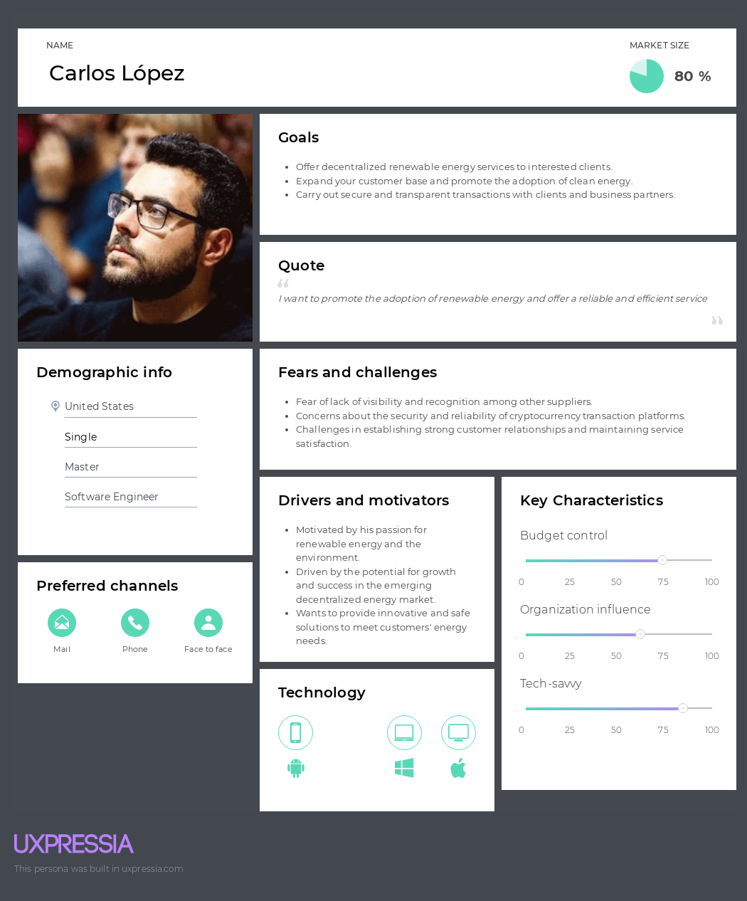
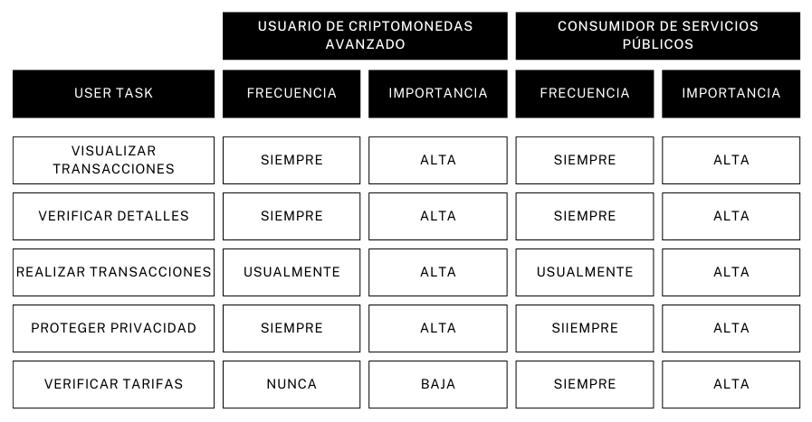
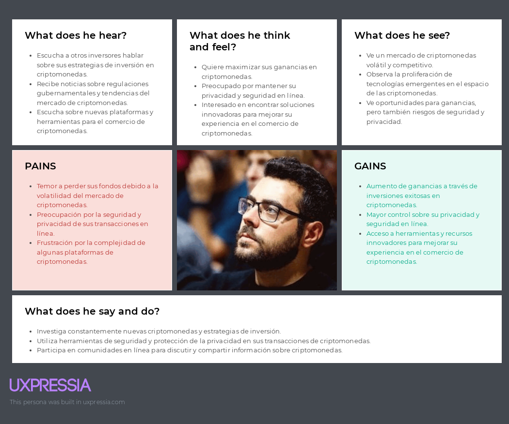
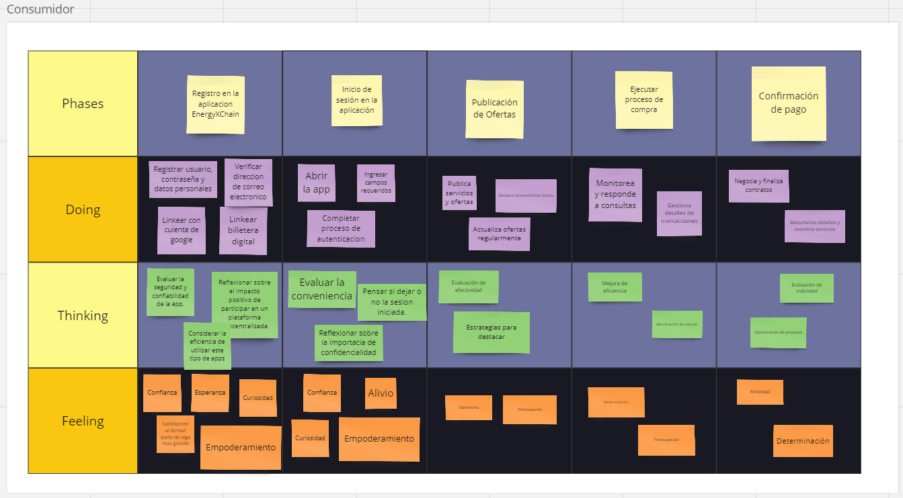
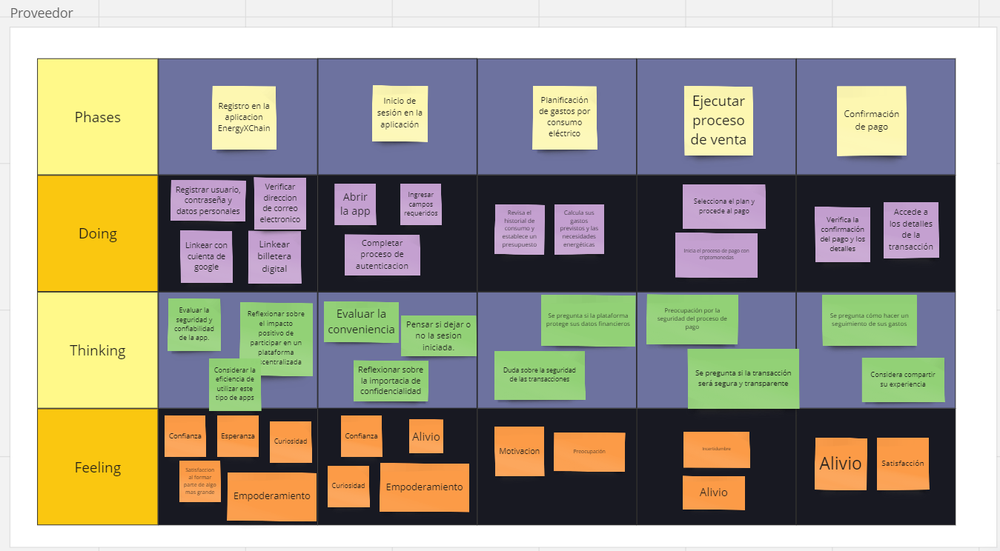

# Capítulo II: Requirements Elicitation & Analysis
---
## 2.1. Competidores
---
### 2.1.1. Análisis competitivo
---
### 2.1.2. Estrategias y tácticas frente a competidores
---
## 2.2. Entrevistas
---
### 2.2.1. Diseño de entrevistas
---
### 2.2.2. Registro de entrevistas
---
### 2.2.3. Análisis de entrevistas
---
## 2.3. Needfinding
---
### 2.3.1. User Personas

+ Consumidor de energía eléctrica y usuario de criptomonedas
  
  

+ Proveedor de energía renovable descentralizada
  
  
---
### 2.3.2. User Task Matrix

---
### 2.3.3. Empathy Mapping

+ Consumidor de energía eléctrica y usuario de criptomonedas
  
  

+ Proveedor de energía renovable descentralizada
  
  
---
### 2.3.4. As-is Scenario Mapping

+ Consumidor
  
  

+ Proveedor
  
  
---
## 2.4. Ubiquitous Language
---