Registro de versiones del informe

| Versión | Fecha      | Autor                                                                                                                                              | Descripción de modificaciones                                 |
|---------|------------|----------------------------------------------------------------------------------------------------------------------------------------------------|---------------------------------------------------------------|
| 1.0     | 13/04/2024 | Kendall Ramiro Contreras Salazar, Piero Anthony Liberato Susanibar, Leonardo Grau, Marzzio Braulio Chicana Romero, Farid Josué Izquierdo Cristobal | Desarrollamos Capítulo 1, Capítulo 2, Capítulo 3 y Capítulo 4 |
| 2.0     | 1/05/2024  | Kendall Ramiro Contreras Salazar, Piero Anthony Liberato Susanibar, Leonardo Grau, Marzzio Braulio Chicana Romero, Farid Josué Izquierdo Cristobal | Desarrollamos Capítulo 5 y Capítulo 6                         |

Enlace Repositorio Documentación Markdown:
<https://github.com/Arquitectura-Software-Emergentes-Grupo1/Reports/blob/main/upc-pre-202302-si728-WS82-EnergyXChain-report-tp1.md>

Student Outcome

**ABET – EAC - Student Outcome 3:** Capacidad de comunicarse
efectivamente con un

rango de audiencias.

En el siguiente cuadro se describe las acciones realizadas y enunciados
de conclusiones

por parte del grupo, que permiten sustentar el haber alcanzado el logro
del ABET – EAC

\- Student Outcome 3.

<table>
<colgroup>
<col style="width: 33%" />
<col style="width: 33%" />
<col style="width: 33%" />
</colgroup>
<thead>
<tr class="header">
<th>Criterio específico</th>
<th>Acciones realizadas</th>
<th>Conclusiones</th>
</tr>
</thead>
<tbody>
<tr class="odd">
<td>
Comunica oralmente sus ideas

y/o resultados con objetividad a

público de diferentes

especialidades y niveles

jerárquicos, en el marco del

desarrollo de un proyecto en

ingeniería.
</td>
<td>
Contreras Salazar, Kendall Ramiro

<strong>TB1</strong>

Se investigó acerca de competidores para el negocio y se realizó plan
de estrategia.

<strong>TP1</strong>

Se investigó diseños relacionados al negocio para conocer las
necesidades mínimas del usuario en nuestra área de negocio.

Farid Josué Izquierdo Cristobal

<strong>TB1</strong>

Se definió el startup, asimismo se identificó los competidores
actuales que se encuentran en el mercado para luego realizar una
comparativa entre la competencia para realizar una estrategia
eficiente.

<strong>TP1</strong>

Se llevaron a cabo investigaciones de diseño relacionadas con nuestra
startup con el fin de comprender las necesidades básicas de nuestros
usuarios en dicha área.

Piero Liberato

<strong>TB1</strong>

Se definió la startup con sus anteceden sus problemática y
antecedentes,

<strong>TP1</strong>

Se realizó el desarrollo de una parte de los corre del negocio de
nuestro startup, como su planteamiento.

Marzzio Chicana Romero

<strong>TB1</strong>

Se idearon los scenarios en los cuales participaran los usuarios
antes de que la aplicación haya sido puesta en producción para definir
el as-is scenario.

<strong>TP1</strong>

Se definieron las capas de arquitectura que abarca el bounded context
smart contract.

Leonardo Grau

<strong>TB1</strong>

Se idearon los scenarios en los cuales participaran los usuarios
antes de que la aplicación haya sido puesta en producción para definir
el to-be scenario.

<strong>TP1</strong>

Se definieron las capas de arquitectura que abarca el bounded context
smart contract.
</td>
<td>
<strong>TB1</strong>

En conclusión, al comunicar oralmente las

ideas y resultados de un proyecto en ingeniería que utiliza Lean UX,
es importante ser claro, objetivo y adaptarse al público al que se
dirige, buscando siempre transmitir de manera comprensible los logros y
resultados alcanzados en el proyecto. 

<strong>TP1</strong>

En conclusión, la habilidad de comunicar

de manera efectiva y objetiva es un aspecto

fundamental en el desarrollo de un

proyecto de ingeniería. El

Desarrollo de Bounded Contexts y figmas con los diseños de nuestro
Application Web y Landing Page nos ayudan a tener claro la estructura y
planes iniciales del negocio para tener una base con la cual empezar el
desarrollo de este. La comunicación

oral efectiva, en combinación con otras

habilidades y herramientas, es esencial para el éxito de cualquier
proyecto de ingeniería.
</td>
</tr>
<tr class="even">
<td>
Comunica en forma escrita ideas

y/o resultados con objetividad a

público de diferentes

especialidades y niveles

jerárquicos, en el marco del

desarrollo de un proyecto en

ingeniería.
</td>
<td>
Contreras Salazar, Kendall Ramiro

<strong>TB1</strong>

Se documentó plan de estrategia contra competidores así como el
Strategic-Level Software Design

<strong>TP1</strong>

Se plasmó en Figma los diseños para la Landing Page y Application
Web, realizando wireframes y mockups.

Farid Josué Izquierdo Cristobal

<strong>TB1</strong>

Se realizaron entrevistas con usuarios para documentar las
suposiciones y declaraciones de hipótesis de Lean UX. Además, se elaboró
un plan de estrategia contra competidores junto con el diseño de
software a nivel estratégico.

<strong>TP1</strong>

Se realizo tanto las arquitecturas siguiendo los patrones de Domain
Driving Design y también los diseños de los wireframes y mockups de la
landing page y el wireframe del aplicativo.

Piero Liberato

<strong>TB1</strong>

Se realizo realizaron entrevistas para entender las necesidades del
usuario y así poder aterrizar mejor nuestro startup.

<strong>TP1</strong>

Se desarrollo la arquitectura siguiendo con patrones de Domain
Driving Design para poder tener una mejor compresión dentro del
equipo

Marzzio Chicana Romero

<strong>TB1</strong>

Se preparó un informe sobre los escenarios de usuario previos al
lanzamiento de la aplicación, detallando el análisis del estado actual y
las expectativas de los usuarios.

<strong>TP1</strong>

Se redactó sobre la arquitectura de smart contracts, explicando las
capas y su relevancia en el proyecto para audiencias con distintos
niveles de especialización técnica.

Leonardo Grau

<strong>TB1</strong>

Se preparó un informe sobre los escenarios de usuario previos al
lanzamiento de la aplicación, detallando el análisis del estado actual y
las expectativas de los usuarios.

<strong>TP1</strong>

Se redactó sobre la arquitectura de smart contracts, explicando las
capas y su relevancia en el proyecto para audiencias con distintos
niveles de especialización técnica.
</td>
<td>
<strong>TB1 </strong>

En conclusión, para comunicar por escrito las ideas y resultados de
un proyecto en ingeniería, es necesario presentar los objetivos y
resultados de manera clara y comprensible, utilizando un lenguaje
sencillo y adaptándose al público al que se dirige. Además, es crucial
ser objetivo y presentar los resultados de manera transparente y
veraz. 

<strong>TP1</strong>

En conclusión, es importante tener en cuenta que la comunicación
efectiva no es un proceso estático y que debe ser continuamente evaluada
y mejorada a lo largo del desarrollo del proyecto. Esto puede incluir la
implementación de herramientas de retroalimentación y la realización de
reuniones regulares para asegurar que todos los miembros del equipo
estén en la misma página.
</td>
</tr>
</tbody>
</table>

Capítulo I: Introducción

1.1. Startup Profile

1.1.1. Descripción de la Startup

Somos una empresa innovadora que se dedica a garantizar la privacidad y
el anonimato en las transacciones, especialmente en el ámbito de las
criptomonedas. Nuestro enfoque se centra en ofrecer una solución segura
y confiable para que los usuarios puedan realizar transacciones con
total confianza. Utilizamos contratos inteligentes para asegurar que los
cargos sean congruentes y transparentes, permitiendo a los usuarios
verificar los detalles de la transacción, como el consumo eléctrico en
el caso de las plantas eléctricas descentralizadas. Nuestro objetivo es
ofrecer una plataforma que garantice la privacidad y la seguridad de las
transacciones en un mundo cada vez más digitalizado

1.1.2. Perfiles de integrantes del equipo

1.2. Solution Profile

1.2.1 Antecedentes y problemática

Con respecto a nuestra propuesta, nos dimos cuenta de la falta de
transparencia y cargos congruentes de la compra del servicio público
como privado. Con respecto a nuestra propuesta, nuestra competencia es
la siguiente:

“Plataformas Digitales Especializadas: La adopción de esta ha
simplificado el acceso a información relevante sobre licitaciones y
compras gubernamentales.

Blockchain: La tecnología blockchain ha sido fundamental para mejorar la
seguridad y transparencia en las transacciones de licitaciones públicas.
Al implementar blockchain, Perú Compras ha registrado más de 154 mil
órdenes de compras, creando un registro inmutable que garantiza la
integridad y reduce los riesgos de prácticas corruptas.

Datos Abiertos: La publicación de datos abiertos relacionados con
licitaciones y compras gubernamentales fomenta la rendición de cuentas y
la participación ciudadana. Esto permite a la sociedad civil realizar un
seguimiento independiente y contribuye a un mayor escrutinio de los
procesos.” Compras estatales (16 febrero, 2024). La tecnología como
garantía de transparencia en las licitaciones públicas y compras del
Estado en Perú. Recuperado el 26 de marzo de 2024, de La tecnología como
garantía de transparencia en las licitaciones públicas y compras del
Estado en Perú - ComprasEstatales.org Problemática

What(Qué)

Actualmente existen opciones con respecto a asegurar que los cargos sean
congruentes y transparentes, como: Plataformas Digitales Especializadas,
Blockchain y Datos abiertos, pero estas están enfocadas en la parte
estatal en la parte de las licitaciones. Nosotros proponemos protección
para las personas naturales ante compras a entidades privadas y
públicas. Para esta manera, asegurándole que está haciendo una
transacción congruente, aparte de segura y confiable.

When (Cuándo)

La problemática surge al momento de realizar un pago de un monto que no
está evidente en la cuenta de pago. En varios sectores si lo disponen,
pero en el caso de la luz es evidente este caso. Así permitiéndoles
estar al tanto de su compra al usuario.

Where (Donde)

Aplicaremos nuestra solución a nivel nacional pero con vistas de hacerlo
a nivel mundial. Comenzaremos en Lima como nuestro primer mvp y seguir
creciendo nuestra startup Who(quién) Nuestra plataforma está dirigida
para cualquier tipo de persona que deseen visualizar la congruencia de
su compra y transparencia, aparte de los demás beneficios que nos brinda
el blockchain.

Why (por qué)

Lo planteamos porque queremos asegurar la congruencia y transparencia en
cualquier compra. Aparte de la seguridad y confianza de cada compra.

How (cómo)

Las personas que deseen realizar la compra de energía por medio de
nuestro web application. Encontrar información relevante dentro nuestra
landing page.

How much (cuánto)

En el Perú existen pocos proyectos para realizar comprar por medio de
cripto monedas y queremos ser un granito de arena para llevar al Perú
más cerca de la revolución de la web 3.

1.2.2 Lean UX Process.

1.2.2.1. Lean UX Problem Statements.

En el servicio de transacciones económicas es una actividad fundamental
en toda persona natural y es necesario tanto para asegurar congruencia y
transparencia en un pago o seguridad y confianza. Y esto no solo abarca
a personas natural, toda persona que realice transacciones económicas es
nuestro mercado objetivo. ¿Cómo aseguramos la congruencia y
transparencia en cada transacción?

1.2.2.2. Lean UX Assumptions.

**Business Outcomes:**

- Aumento en la confianza del cliente: Lograr que los clientes confíen
  en la plataforma para realizar transacciones económicas al ofrecer
  seguridad, transparencia y protección de datos, lo que resultaría en
  una mayor retención de clientes y lealtad a largo plazo.

- Reducción de disputas y fraudes: Minimizar las disputas y casos de
  fraude al garantizar la congruencia y transparencia en cada
  transacción, lo que resultaría en ahorros de costos asociados a
  resolución de problemas y compensaciones.

- Incremento en la adopción de la plataforma: Atraer a más usuarios a
  utilizar la plataforma al ofrecer una experiencia intuitiva y sin
  fricciones, lo que se traduciría en un aumento en el volumen de
  transacciones y potencialmente en mayores ingresos por comisiones.

- Ampliación del mercado objetivo: Al dirigirse tanto a clientes como
  proveedores, se podría aumentar la base de usuarios y mejorar la
  liquidez de la plataforma, lo que podría abrir oportunidades para
  expandirse a nuevos segmentos de mercado en el futuro.

**Users:**

- Clientes

- Proveedores

**User Outcomes:**

- Facilidad de uso: Los clientes pueden esperar una plataforma intuitiva
  y de fácil navegación que les permita realizar transacciones de manera
  rápida y sencilla.

- Seguridad de las transacciones: Los clientes desean sentirse seguros
  al realizar transacciones en la plataforma, sabiendo que sus datos
  personales y financieros están protegidos contra fraudes y usos no
  autorizados.

- Transparencia en los precios y condiciones: Los clientes valoran la
  transparencia en los precios y condiciones de las transacciones, lo
  que les permite tomar decisiones informadas y evitar sorpresas
  desagradables.

- Control sobre las transacciones: Los clientes desean tener control
  sobre sus transacciones, incluyendo la capacidad de verificar el
  estado de sus pagos, recibir notificaciones de actividad y establecer
  preferencias de seguridad.

- Confianza en la plataforma: Los clientes buscan una plataforma en la
  que puedan confiar para realizar sus transacciones de manera segura y
  confiable, lo que les brinda tranquilidad y comodidad al usar el
  servicio.

- Protección contra fraudes y disputas: Los proveedores necesitan
  protección contra fraudes y disputas relacionadas con las
  transacciones, así como un proceso claro para la resolución de
  problemas en caso de discrepancias.

- Pago puntual y transparente: Los proveedores esperan recibir pagos de
  manera puntual y transparente, con información clara sobre los montos
  y las condiciones de las transacciones.

- Relación de confianza con los clientes: Los proveedores buscan
  establecer relaciones de confianza con sus clientes a través de la
  plataforma, lo que puede traducirse en clientes recurrentes y
  referencias positivas.

**Features:**

- Transparencia en las Transacciones: Detalles claros y transparentes
  sobre los precios, tarifas y condiciones de las transacciones para que
  los usuarios puedan tomar decisiones informadas y confiar en la
  plataforma.

- Gestión de Cuenta Personalizada: Herramientas para que los usuarios
  gestionen sus cuentas de manera eficiente, incluyendo la visualización
  de historiales de transacciones, la configuración de preferencias de
  seguridad y la gestión de notificaciones.

- Notificaciones en Tiempo Real: Capacidades de notificación que
  mantengan a los usuarios informados sobre el estado de sus
  transacciones, alertas de seguridad y actualizaciones importantes
  relacionadas con la plataforma.

- Perfiles Personalizados: La capacidad para que los usuarios creen
  perfiles personalizados que reflejen sus preferencias, historial de
  transacciones y otra información relevante para mejorar la experiencia
  de usuario.

- Protección de Pagos: Mecanismos de protección de pagos para garantizar
  que todas las transacciones se realicen de manera segura y que los
  usuarios estén protegidos contra fraudes y actividades maliciosas.

1.  **Creo que mis usuarios necesitan**, una solución confiable y
    eficiente para gestionar sus pagos de consumo de energía de manera
    segura y transparente. Necesitan una plataforma que les brinde la
    tranquilidad de que sus transacciones energéticas se realizan de
    manera segura y que les permita acceder fácilmente a información
    detallada sobre su consumo de energía.

2.  **Estas necesidades se pueden resolver con,** una plataforma basada
    en tecnología blockchain que garantice la seguridad y la
    transparencia en las transacciones de energía. Además, ofreceremos
    características como monitoreo en tiempo real del consumo de
    energía, notificaciones sobre eventos relacionados con el suministro
    de energía y herramientas analíticas para optimizar el uso de
    energía.

3.  **Mis clientes iniciales son (o serán)** consumidores residenciales,
    propietarios de pequeñas empresas y proveedores de servicios
    energéticos que buscan una solución moderna y confiable para
    gestionar sus pagos de consumo de energía. Además, nos enfocaremos
    en establecer asociaciones con empresas de servicios públicos y
    proveedores de energía renovable para llegar a una base de clientes
    más amplia.

4.  **El valor \#1 que un cliente quiere de mi servicio es** la
    capacidad de gestionar sus pagos de consumo de energía de manera
    segura y eficiente utilizando tecnología blockchain. Los clientes
    buscan una solución que les brinde transparencia en sus
    transacciones energéticas y les permita realizar pagos de forma
    descentralizada y confiable.

5.  **El cliente también puede obtener beneficios adicionales,** como la
    capacidad de monitorear su consumo de energía en tiempo real,
    recibir notificaciones sobre eventos relacionados con el suministro
    de energía y acceder a herramientas analíticas para optimizar su uso
    de energía y reducir costos.

6.  **Voy a adquirir la mayoría de mis clientes a través** de
    estrategias de marketing digital centradas en la creación de
    conciencia de marca, la generación de leads y la adquisición de
    clientes a través de canales en línea como redes sociales, motores
    de búsqueda y publicidad pagada. Además, aprovecharé el boca a boca
    y las recomendaciones de usuarios satisfechos para aumentar la base
    de clientes.

7.  **Haremos dinero a través de** comisiones por transacción en la
    plataforma, servicios premium que ofrecen características
    adicionales como análisis avanzado de datos energéticos y
    asociaciones estratégicas con empresas de servicios públicos para
    integrar nuestra solución en sus sistemas de pago existentes.

8.  **Mi competencia principal en el mercado serán,** otras plataformas
    de pago de consumo de energía, sistemas de gestión de energía y
    proveedores de servicios públicos que ofrecen soluciones similares.
    Además, la competencia también puede provenir de soluciones de pago
    tradicionales que no utilizan tecnología blockchain.

9.  **Los venceremos debido a** nuestro enfoque en la seguridad y la
    transparencia utilizando tecnología blockchain, así como nuestra
    capacidad para ofrecer características adicionales como monitoreo en
    tiempo real del consumo de energía y herramientas analíticas
    avanzadas. Además, nos diferenciaremos mediante una experiencia de
    usuario intuitiva y un servicio al cliente excepcional.

10. **Mis mayores riesgos de producto son,** posibles vulnerabilidades
    de seguridad, problemas técnicos o interrupciones del servicio que
    podrían socavar la confianza de los usuarios y afectar negativamente
    la reputación de la plataforma.

11. **Resolveremos esto a través de** la implementación de rigurosas
    medidas de seguridad y pruebas exhaustivas de calidad para
    garantizar la fiabilidad y estabilidad de la plataforma. Además,
    estaremos atentos a los comentarios de los usuarios y nos
    comprometeremos a abordar rápidamente cualquier problema que surja
    para mantener la confianza de nuestros clientes.

- ¿Quién es el usuario?

El usuario de nuestra plataforma de pago de consumo de energía
utilizando blockchain puede ser cualquier individuo, hogar o empresa que
necesite gestionar sus pagos de energía de manera eficiente y segura.
Además, incluye a proveedores de servicios energéticos que deseen
ofrecer sus servicios a través de la plataforma.

- ¿Dónde encaja nuestro producto en su trabajo o vida?

Nuestro producto encaja en la vida cotidiana y el trabajo de los
usuarios al proporcionarles una forma conveniente de realizar pagos de
consumo de energía de manera descentralizada y transparente. Desde el
seguimiento del uso de energía hasta la realización de pagos
automáticos, nuestra plataforma simplifica la gestión de los servicios
energéticos.

- ¿Cómo y cuándo es usado nuestro producto?

Nuestro producto es utilizado principalmente a través de dispositivos
conectados a Internet, como computadoras, teléfonos inteligentes y
dispositivos domésticos inteligentes. Los usuarios pueden acceder a la
plataforma en cualquier momento y lugar para monitorear su consumo de
energía, realizar pagos y administrar su cuenta.

- ¿Qué problema tendría nuestro producto y cómo se pueden resolver?

Un problema potencial de nuestro producto podría ser la complejidad
técnica asociada con el uso de la tecnología blockchain para realizar
pagos de energía. Esto se puede abordar mediante la implementación de
una interfaz de usuario intuitiva y educativa, así como proporcionando
soporte técnico y recursos de capacitación para los usuarios.

- ¿Qué características son importantes?

Las características importantes incluyen seguridad blockchain avanzada,
transparencia en las transacciones, facilidad de uso, monitoreo en
tiempo real del consumo de energía, automatización de pagos,
notificaciones sobre eventos relacionados con el suministro de energía y
análisis detallado del uso de energía.

- ¿Cómo debe verse nuestro servicio y cómo debe comportarse?

Nuestro servicio debe tener una interfaz de usuario limpia y moderna que
refleje la innovación y la confiabilidad de la tecnología blockchain.
Debe comportarse de manera eficiente y sin problemas, brindando a los
usuarios una experiencia fluida desde el registro hasta la realización
de pagos, y garantizando la seguridad y la integridad de cada
transacción.

1.2.2.3. Lean UX Hypothesis Statements.

1st Hypothesis Statement

Creemos que al ofrecer un monitoreo en tiempo real del consumo de
energía y notificaciones sobre eventos relacionados con el suministro de
energía, los usuarios estarán más empoderados y podrán tomar decisiones
informadas sobre su uso de energía.

Sabremos que habremos tenido éxito,

Cuando observemos que al menos el 70% de los usuarios utilizan
regularmente las funciones de monitoreo en tiempo real y notificaciones,
y cuando veamos una reducción del 10% en el consumo de energía promedio
por usuario después de seis meses de uso de la plataforma.

2nd Hypothesis Statement

Creemos que al ofrecer herramientas analíticas avanzadas para optimizar
el uso de energía, ayudaremos a los usuarios a reducir sus costos
energéticos y a mejorar su eficiencia energética.

Sabremos que habremos tenido éxito,

Cuando observemos una disminución del 15% en los costos promedio de
energía de los usuarios después de un año de uso de la plataforma, y
cuando recibamos retroalimentación positiva de al menos el 70% de los
usuarios sobre la utilidad y la eficacia de las herramientas analíticas.

3rd Hypothesis Statement

Creemos que al proporcionar un servicio de atención al cliente
excepcional, aumentaremos la satisfacción del usuario y fomentaremos la
lealtad a la marca.

Sabremos que habremos tenido éxito,

Cuando alcancemos una calificación promedio de satisfacción del cliente
de al menos 4.5 sobre 5 en las encuestas de satisfacción, y cuando
observemos un aumento del 30% en el número de usuarios recurrentes
después de seis meses de implementar mejoras en el servicio al cliente.

4rd Hypothesis Statement

Creemos que al establecer asociaciones estratégicas con proveedores de
servicios públicos y empresas de energía renovable, ampliaremos nuestra
base de usuarios y aumentaremos nuestra participación en el mercado.

Sabremos que habremos tenido éxito,

Cuando observemos un aumento del 25% en el número de usuarios
registrados después de seis meses de lanzamiento de las asociaciones, y
cuando alcancemos una participación de mercado del 15% en nuestra área
de operación dentro del primer año de implementar las asociaciones.

1.2.2.4. Lean UX Canvas.

<table>
<colgroup>
<col style="width: 41%" />
<col style="width: 32%" />
<col style="width: 26%" />
</colgroup>
<thead>
<tr class="header">
<th><strong>Business Problem</strong> 
 
El problema identificado es la falta de transparencia y seguridad en las
transacciones de pago de consumo de energía.</th>
<th rowspan="2">
<strong>Solution Ideas</strong>

<ul>
<li>
Implementación de blockchain para garantizar la transparencia y
seguridad en las transacciones.
</li>
<li>
Desarrollo de una plataforma de pago intuitiva y fácil de usar
para clientes y proveedores.
</li>
<li>
Integración de sistemas de monitoreo de consumo de energía en
tiempo real.
</li>
</ul></th>
<th>
<strong>Business Outcomes</strong>

Cambios en el comportamiento del usuario: Los usuarios realizan
transacciones de pago de energía de manera más frecuente y
confiable.
</th>
</tr>
<tr class="odd">
<th>
<strong>User &amp; Customers</strong> 
 
Clientes: personas o empresas que consumen energía y necesitan pagar sus
facturas de manera segura y transparente.

Proveedores: empresas que suministran energía y requieren recibir
pagos de manera confiable y eficiente.
</th>
<th>
<strong>User Benefits</strong>

Clientes: Obtener una forma segura y transparente de pagar sus
facturas de consumo de energía.

Proveedores: Recibir pagos de manera confiable y eficiente, lo que
mejora su flujo de efectivo.
</th>
</tr>
</thead>
<tbody>
<tr class="odd">
<td><strong>Hypotheses</strong> 
 
Creemos que los usuarios adoptarán la plataforma de pago si les
proporcionamos una forma segura y transparente de realizar
transacciones.</td>
<td>
<strong>What’s the most important</strong> 
<strong>thing we need to learn</strong> 
<strong>first?</strong>

La suposición más importante es que los usuarios confiarán en nuestra
plataforma para realizar transacciones financieras relacionadas con el
consumo de energía.
</td>
<td><strong>What’s the least amount of work</strong> 
<strong>we need to do to learn the most</strong> 
<strong>important</strong> <strong>thing?</strong> 
 
Realizar pruebas piloto con un grupo de usuarios seleccionado para
evaluar su confianza en la plataforma y recopilar comentarios sobre su
experiencia de uso.</td>
</tr>
</tbody>
</table>

1.3. Segmentos objetivo.

Capítulo II: Requirements Elicitation & Analysis

2.1. Competidores.

2.1.1. Análisis competitivo.

**Zcash**

Overview: Zcash es una criptomoneda centrada en la privacidad que
utiliza tecnología de prueba de conocimiento cero para permitir
transacciones completamente anónimas.

Ventaja competitiva: Ofrece un alto nivel de privacidad y anonimato en
las transacciones, lo que atrae a usuarios preocupados por la
confidencialidad de sus actividades financieras.

Mercado Objetivo: Principalmente usuarios de criptomonedas interesados
en mantener la privacidad y el anonimato en sus transacciones.

Estrategias de marketing: Zcash se ha promocionado como una alternativa
segura y privada a otras criptomonedas, destacando su enfoque en la
privacidad y la confidencialidad.

Productos & Servicios: Ofrece una plataforma para realizar transacciones
completamente anónimas y seguras utilizando su criptomoneda ZEC

Precios y costos: Los precios de ZEC varían según el mercado y la
demanda, pero en general, ofrece costos competitivos en comparación con
otras criptomonedas centradas en la privacidad.

Canales de distribución: Se distribuye principalmente a través de
exchanges de criptomonedas y plataformas de comercio en línea que
admiten ZEC.

FODA:

Fortalezas: Alta privacidad y anonimato en las transacciones, tecnología
avanzada de prueba de conocimiento cero.

Debilidades: Menos reconocimiento y adopción que criptomonedas más
establecidas como Bitcoin o Ethereum.

Oportunidades: Mayor demanda de privacidad financiera en un mundo
digitalizado, crecimiento potencial en el mercado de las criptomonedas
centradas en la privacidad.

Amenazas: Competencia de otras criptomonedas centradas en la privacidad,
regulaciones gubernamentales que podrían afectar su uso.

**Monero**

Overview: Monero es una criptomoneda enfocada en la privacidad que
utiliza técnicas de encriptación avanzadas para garantizar la
confidencialidad de las transacciones.

Ventaja competitiva: Ofrece un alto nivel de anonimato y fungibilidad,
lo que significa que todas las unidades de Monero son intercambiables
entre sí, lo que dificulta el rastreo de las transacciones.

Mercado Objetivo: Usuarios de criptomonedas preocupados por la
privacidad y la confidencialidad de sus transacciones financieras en
línea.

Estrategias de marketing: Monero se promociona como una opción segura y
privada para realizar transacciones en línea, destacando su enfoque en
la privacidad y la fungibilidad de la moneda.

Productos & Servicios: Ofrece una plataforma para realizar transacciones
privadas y seguras utilizando su criptomoneda XMR, así como soporte para
diversas aplicaciones y servicios basados en Monero.

Precios y costos: Los precios de XMR varían según el mercado y la
demanda, pero Monero generalmente ofrece costos competitivos en
comparación con otras criptomonedas centradas en la privacidad.

Canales de distribución: Se distribuye principalmente a través de
exchanges de criptomonedas y plataformas de comercio en línea que
admiten XMR.

FODA:

Fortalezas: Alta privacidad y fungibilidad, amplia adopción en el
mercado de criptomonedas centradas en la privacidad.

Debilidades: Menos reconocimiento público que criptomonedas más
establecidas como Bitcoin, posibles preocupaciones regulatorias sobre el
uso de la privacidad en transacciones financieras.

Oportunidades: Mayor demanda de privacidad financiera en un mundo
digitalizado, crecimiento potencial en el mercado de las criptomonedas
centradas en la privacidad.

Amenazas: Competencia de otras criptomonedas centradas en la privacidad,
regulaciones gubernamentales que podrían afectar su uso.

**Horizen**

Overview: Horizen, anteriormente conocido como ZenCash, es una
plataforma blockchain que ofrece transacciones privadas y transparentes,
así como funcionalidades de escalabilidad e interoperabilidad.

Ventaja competitiva: Además de la privacidad en las transacciones,
Horizen ofrece características adicionales como escalabilidad e
interoperabilidad, lo que lo distingue de otros competidores al
proporcionar un conjunto más completo de funcionalidades blockchain.

Mercado Objetivo: Usuarios de criptomonedas interesados en la privacidad
y la seguridad de sus transacciones, así como aquellos que valoran la
escalabilidad y la interoperabilidad en una plataforma blockchain.

Estrategias de marketing: Horizen se comercializa como una solución
completa para las necesidades de privacidad y seguridad en el espacio
blockchain, destacando sus características únicas y su enfoque en la
innovación tecnológica.

Productos & Servicios: Ofrece una plataforma blockchain que permite
realizar transacciones privadas y transparentes, así como
funcionalidades adicionales como escalabilidad e interoperabilidad a
través de su criptomoneda ZEN.

Precios y costos: Los precios de ZEN varían según el mercado y la
demanda, pero Horizen generalmente ofrece costos competitivos en
comparación con otras plataformas blockchain centradas en la privacidad.

Canales de distribución: Se distribuye principalmente a través de
exchanges de criptomonedas y plataformas de comercio en línea que
admiten ZEN, así como a través de su propia plataforma y asociaciones
estratégicas.

FODA:

Fortalezas: Privacidad en las transacciones, escalabilidad,
interoperabilidad, tecnología innovadora.

Debilidades: Menos reconocimiento público que criptomonedas más
establecidas como Bitcoin, competencia en el mercado de plataformas
blockchain.

Oportunidades: Mayor demanda de privacidad y seguridad en transacciones
financieras, crecimiento potencial en el mercado de blockchain.

Amenazas: Competencia de otras plataformas blockchain, regulaciones
gubernamentales que podrían afectar su uso.

2.1.2. Estrategias y tácticas frente a competidores.

Estamos comprometidos con la excelencia y la innovación en el mercado de
las criptomonedas centradas en la privacidad. Aquí presentamos algunas
estrategias para destacar nuestro producto sobre los demás:

Diferenciación en la privacidad: Nos distinguiremos por nuestra
capacidad para garantizar la privacidad y el anonimato en las
transacciones, utilizando contratos inteligentes para asegurar la
transparencia y la seguridad en cada interacción.

Innovación continua: Estamos comprometidos con la innovación constante,
buscando constantemente nuevas formas de mejorar nuestra plataforma y
ofrecer soluciones más efectivas para las necesidades de privacidad de
nuestros usuarios.

Educación y concientización: Reconocemos la importancia de educar a
nuestros usuarios sobre los riesgos asociados con la falta de privacidad
en las transacciones financieras en línea. Nuestras campañas de
concientización resaltarán estos riesgos y cómo nuestra plataforma los
abordará de manera efectiva.

Colaboraciones estratégicas: Estableceremos asociaciones estratégicas
con otras empresas y proyectos en el espacio blockchain para fortalecer
nuestra posición en el mercado y ofrecer soluciones más completas a
nuestros usuarios.

Mejora de la experiencia del usuario: Priorizaremos la experiencia del
usuario en nuestra plataforma, asegurándonos de que cada interacción sea
intuitiva, segura y satisfactoria para nuestros usuarios.

Estrategias de precios competitivos: Ofreceremos precios competitivos y
transparentes para nuestros servicios.

Monitoreo de la competencia: Mantendremos un seguimiento constante de
las acciones y estrategias de nuestros competidores para identificar
oportunidades y amenazas en el mercado, ajustando nuestras propias
estrategias en consecuencia para mantener nuestra ventaja competitiva.

2.2. Entrevistas.

2.2.1. Diseño de entrevistas.

En esta sección, mostraremos las preguntas que hemos generado para
realizar las entrevistas a los dos tipos de usuarios objetivos. Cabe
destacar, que las preguntas realizadas son de tipo abierto, con el
objetivo de recolectar información relevante que nos ayude a tener una
idea más precisa de cómo solucionar problemas de nuestros usuarios
objetivos

**Clientes:**

¿Con qué frecuencia realizas transacciones económicas con entidades
privadas o públicas relacionadas con la energía descentralizada?

¿Qué importancia le das a la transparencia y congruencia en las
transacciones relacionadas con la energía descentralizada?

¿Has tenido alguna experiencia previa con transacciones relacionadas con
la energía descentralizada que te haya preocupado por su seguridad o
transparencia?

¿Qué medidas tomas actualmente para garantizar que las transacciones de
energía descentralizada sean seguras y transparentes?

¿Qué características consideras más importantes al buscar una plataforma
para realizar transacciones de energía descentralizada de manera segura?

¿Estarías interesado en utilizar una plataforma que garantice la
congruencia y transparencia en las transacciones de energía
descentralizada? ¿Por qué sí o por qué no?

¿Qué funcionalidades te gustaría que incluyera una plataforma de este
tipo para hacer transacciones de energía descentralizada?

**Proveedores:**

¿Con qué frecuencia proporcionas servicios o productos relacionados con
la energía descentralizada a tus clientes?

¿Cuáles son los mayores desafíos que enfrentas al realizar transacciones
de energía descentralizada con tus clientes en términos de seguridad y
transparencia?

¿Qué medidas tomas actualmente para garantizar que las transacciones de
energía descentralizada con tus clientes sean seguras y transparentes?

¿Qué características valorarías más en una plataforma que facilite las
transacciones de energía descentralizada con tus clientes?

¿Estarías dispuesto a utilizar una plataforma que garantice la
congruencia y transparencia en las transacciones de energía
descentralizada con tus clientes? ¿Por qué sí o por qué no?

¿Qué aspectos te preocupan más al realizar transacciones de energía
descentralizada con tus clientes?

¿Qué mejoras crees que podrían implementarse para hacer que las
transacciones de energía descentralizada sean más seguras y
transparentes para proveedores como tú?

2.2.2. Registro de entrevistas.

**Segmento 1 Cliente**

Entrevistado 1:

Nombre y Apellido: Jonatan Omar Curi Montero

Edad: 22 años

Resumen: Jonatan es un cliente que tiene el deber de pagar mensualmente
la cuenta de luz de su casa, y como responsable de esto ha pasado por
experiencias negativas con su actual proveedor. Jonatan cuenta como ha
sufrido de inconvenientes como de una medición incorrecta en su consumo
y un largo tiempo de espera hasta llegar a una solución por el error del
encargado de realizar las medidas de consumo. Jonatan menciona que le
gustaría una plataforma transparente donde pueda ver la información de
sus recibos y donde se asegure la correcta medición y seguridad de su
consumo de energía.

Link: <https://youtu.be/ylMqK7QuOqs>

Entrevistado 2:

Nombre y Apellido: Rafael Agustin Pacheco Lavado

Edad: 21

Resumen: Agustín, en su rol de contribuyente al sostenimiento del hogar
familiar, está iniciando el proceso de abonar los servicios básicos de
su residencia. En su búsqueda de una gestión más segura y eficiente de
dichos pagos, aspira a contar con una plataforma que garantice la
transparencia y seguridad necesarias. Anhela disponer de un sistema
donde pueda monitorear detalladamente el historial de transacciones y
asegurarse de la ejecución precisa de cada una de ellas.

Link:
<https://drive.google.com/file/d/1rpAvuj2-pcmVAofFOqvQ7fS_Vs-kjmH9/view?usp=sharing>

Entrevistado 3:

Nombre y Apellido: Sergio Aldair Liberato Susanibar

Edad: 21

Resumen:

Sergio vive desde 3 años en casa alquilada, y realiza pagos cada mes de
luz. Este a notado problemas al realizar pagos, por ejemplo, una vez le
dijeron que debía 2 meses, pero ya lo había cancelado, y tuvo que buscar
todos los recibos en donde se encontraba ese en específico. Esta persona
estaría dispuesta a comprar energía descentralizada en el caso de que
sea más barato, y evitar problemas al realizar esta transacción. El
busca la menor cantidad de complicaciones en este caso de la compra de
energía.

Link:
<https://drive.google.com/file/d/1nMlyjuh7sfLz0rh4ZH2MD8dwh2Gq5Prr/view?usp=sharing>

**Segmento 2 Proveedores**

Entrevistado 1:

Nombre y apellidos: Job Javier Izquierdo Cristobal

Edad: 31 años

Job es un proveedor de energía descentralizada y en esta entrevista Job
nos comparte sus experiencias e inquietudes con respecto a las
transacciones de energía descentralizada con los clientes. Job nos
expresa que existen desafíos respecto a la seguridad y transparencia,
incluidas transacciones incompletas o revertidas que requieren
verificación y corrección manual. Por lo que, sus principales
preocupaciones son los pagos incompletos y los reembolsos no
autorizados, lo que sugiere como posible solución es que se tenga la
autorización respectiva por parte del proveedor para poder realizar los
reembolsos y así evitar los cambios de transacciones no autorizadas con
el cliente. Actualmente, el entrevistado nos menciona que le gustaría
que existiera una plataforma que automatice la validación de las
transacciones y de esta manera se pueda simplificar el seguimiento de
los pagos y de esta manera poder permitir una fácil gestión de los
datos.

Link: <https://www.youtube.com/watch?v=99gkrNmYZD4>

2.2.3. Análisis de entrevistas.

A continuación, se desarrolla una estrategia en conjunto con el equipo
para identificar los puntos en común en base a las respuestas de cada
entrevistado a cada pregunta. Esto nos ayuda a realizar un análisis más
conciso y seguro para desarrollar nuestra plataforma en base a la
información recolectada.

Según nuestra encuesta observamos en nuestro segmento cliente que son la
mayoría hombres.

2.3. Needfinding.

2.3.1. User Personas.

\- Consumidor de energía eléctrica y usuario de criptomonedas:

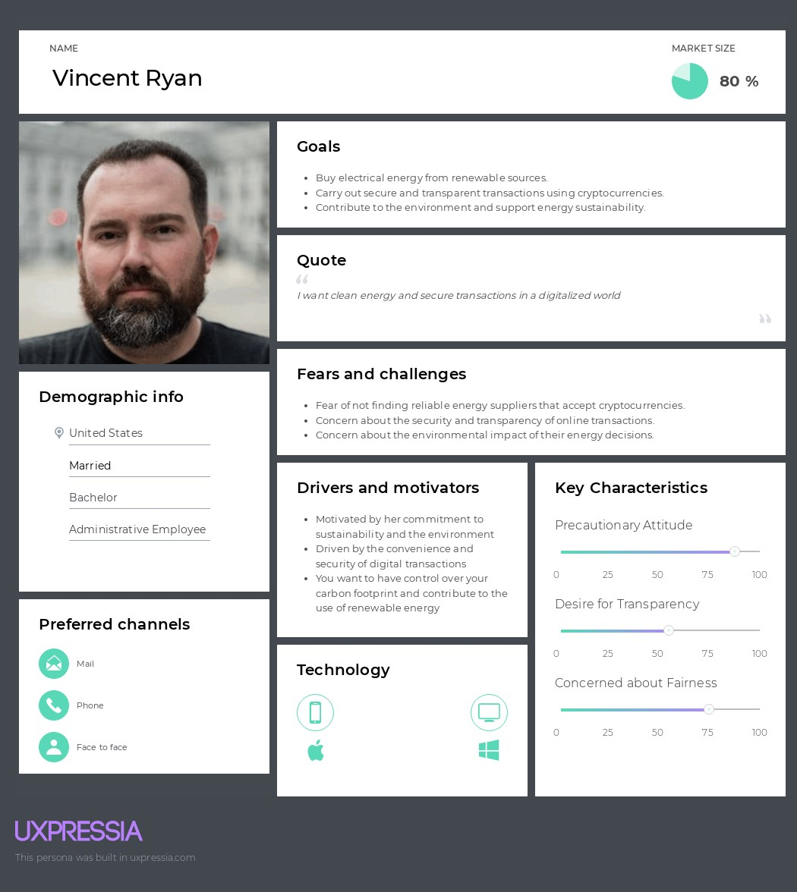

\- Proveedor de energía renovable descentralizada:

2.3.2. User Task Matrix.

2.3.3. Empathy Mapping.

\- Consumidor de energía eléctrica y usuario de criptomonedas:

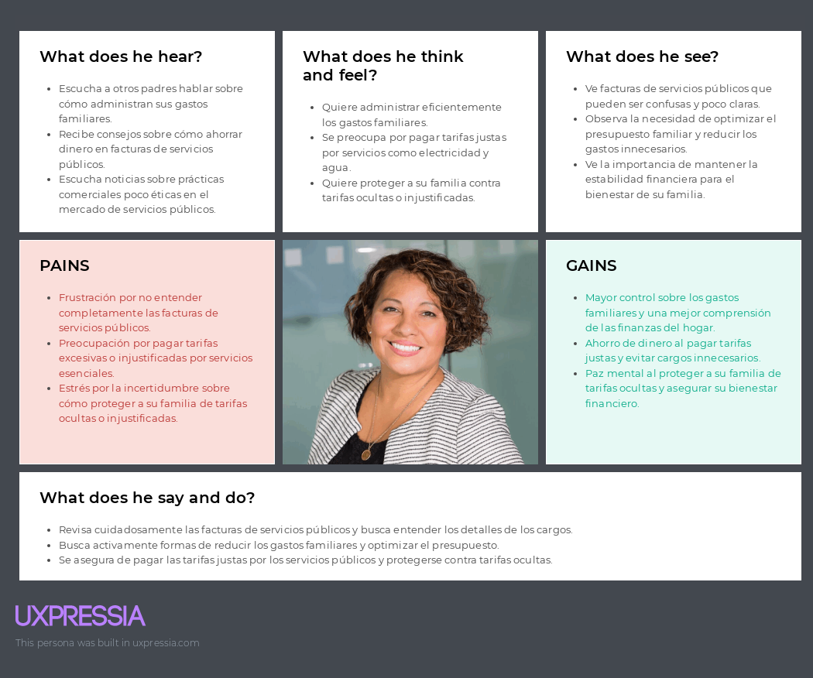

\- Proveedor de energía renovable descentralizada:

2.3.4. As-is Scenario Mapping.

\- Consumidor:

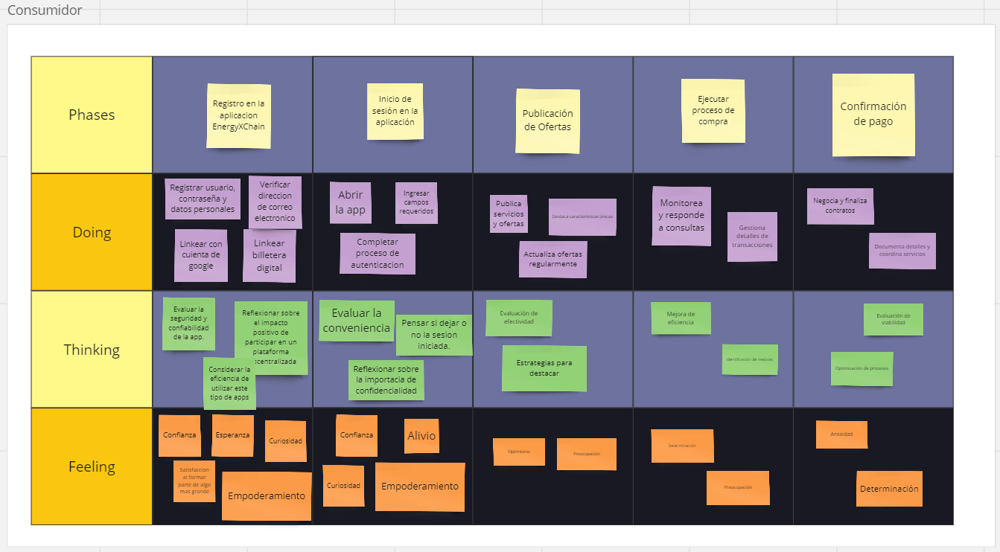

\- Proveedor:

2.4. Ubiquitous Language.

Capítulo III: Requirements Specification

3.1. To-Be Scenario Mapping.

\- Consumidor:

- Proveedor:

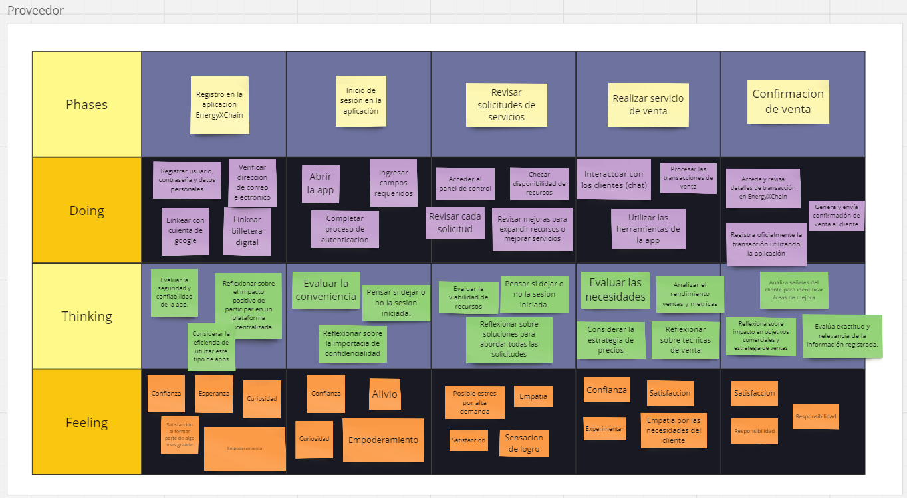

3.2. User Stories.

| **ID**                                                                                                                                                                                                                                       | **Usuario**                                          |
|----------------------------------------------------------------------------------------------------------------------------------------------------------------------------------------------------------------------------------------------|------------------------------------------------------|
| USC01                                                                                                                                                                                                                                        | Consumidor                                           |
| **Titulo**                                                                                                                                                                                                                                   | Visualización de proveedores de energía registrados  |
| **Descripción**                                                                                                                                                                                                                              |                                                      |
| **Como** usuario registrado, **quiero** poder ver un listado de los proveedores de energía descentralizada disponibles en mi área, **para** poder comparar precios y opciones antes de realizar una compra.                                  |                                                      |
| **Criterio de aceptación**                                                                                                                                                                                                                   |                                                      |
| Escenario 1                                                                                                                                                                                                                                  |                                                      |
| **Dado que** el usuario está registrado e inició sesión, **cuando** accede a la sección de proveedores de energía, **entonces** la aplicación muestra una lista de proveedores disponibles en su área.                                       |                                                      |
| Escenario 2                                                                                                                                                                                                                                  |                                                      |
| **Dado que** el usuario quiere seleccionar un proveedor de la lista, **cuando** el usuario selecciona un proveedor de la lista, la aplicación muestra detalles como precios por kilovatio-hora (kWh), tipo de energía ofrecida y ubicación.  |                                                      |

| **ID**                                                                                                                                                                                                                | **Usuario**                                      |
|-----------------------------------------------------------------------------------------------------------------------------------------------------------------------------------------------------------------------|--------------------------------------------------|
| USC03                                                                                                                                                                                                                 | Consumidor                                       |
| **Titulo**                                                                                                                                                                                                            | Monitoreo en Tiempo Real del Consumo de Energía  |
| **Descripción**                                                                                                                                                                                                       |                                                  |
| **Como** usuario registrado, **quiero** poder monitorear mi consumo de energía en tiempo real a través de la aplicación, **para** poder tomar decisiones informadas sobre mi uso y optimizar mis costos energéticos.  |                                                  |
| **Criterio de aceptación**                                                                                                                                                                                            |                                                  |
| Escenario 1                                                                                                                                                                                                           |                                                  |
| **Dado que el usuario está registrado e inició sesión, cuando accede a la sección de monitoreo de energía, la aplicación muestra el consumo actualizado en tiempo real.**                                             |                                                  |
| Escenario 2                                                                                                                                                                                                           |                                                  |
| **Cuando el usuario visualiza su consumo, la aplicación también proporciona gráficos o estadísticas claras para facilitar la comprensión y la toma de decisiones informadas.**                                        |                                                  |

| **ID**                                                                                                                                                                                                                                                                             | **Usuario**                                  |
|------------------------------------------------------------------------------------------------------------------------------------------------------------------------------------------------------------------------------------------------------------------------------------|----------------------------------------------|
| USP01                                                                                                                                                                                                                                                                              | Proveedor                                    |
| **Titulo**                                                                                                                                                                                                                                                                         | Venta de Exceso de Energía a Otros Usuarios  |
| **Descripción**                                                                                                                                                                                                                                                                    |                                              |
| **Como usuario registrado, quiero poder vender el exceso de energía generada por mi sistema de energía descentralizada a otros usuarios a través de contratos inteligentes en la blockchain, para poder recuperar parte de mi inversión y contribuir a la red energética local.**  |                                              |
| **Criterio de aceptación**                                                                                                                                                                                                                                                         |                                              |
| Escenario 1                                                                                                                                                                                                                                                                        |                                              |
| **Dado que el usuario tiene exceso de energía generada por su sistema descentralizado, cuando accede a la opción de venta de energía, la aplicación le permite establecer los términos de la transacción, como la cantidad de energía disponible y el precio.**                    |                                              |
| Escenario 2                                                                                                                                                                                                                                                                        |                                              |
| **Cuando otro usuario realiza una compra de energía, entonces el contrato inteligente en la blockchain se ejecuta automáticamente para transferir la energía y realizar el pago correspondiente al vendedor.**                                                                     |                                              |

| **ID**                                                                                                                                                                                                                                                                                                             | **Usuario**                                                                          |
|--------------------------------------------------------------------------------------------------------------------------------------------------------------------------------------------------------------------------------------------------------------------------------------------------------------------|--------------------------------------------------------------------------------------|
| USG01                                                                                                                                                                                                                                                                                                              | Usuarios Generales                                                                   |
| **Titulo**                                                                                                                                                                                                                                                                                                         | Recepción de Notificaciones sobre Eventos Relacionados con el Suministro de Energía  |
| **Descripción**                                                                                                                                                                                                                                                                                                    |                                                                                      |
| **Como usuario registrado, quiero recibir notificaciones automáticas sobre eventos importantes relacionados con mi suministro de energía descentralizada, como mantenimiento programado, interrupciones en el servicio o cambios en los precios, para poder planificar en consecuencia y evitar inconvenientes.**  |                                                                                      |
| **Criterio de aceptación**                                                                                                                                                                                                                                                                                         |                                                                                      |
| Escenario 1                                                                                                                                                                                                                                                                                                        |                                                                                      |
| **Dado que el usuario está registrado e inició sesión, cuando ocurre un evento relevante para su suministro de energía (como mantenimiento programado, interrupciones en el servicio o cambios en los precios), la aplicación le envía una notificación automática.**                                              |                                                                                      |
| Escenario 2                                                                                                                                                                                                                                                                                                        |                                                                                      |
| **Cuando el usuario recibe una notificación, esta proporciona información clara y detallada sobre el evento, incluyendo la fecha y hora programadas, la duración estimada y las acciones recomendadas.**                                                                                                           |                                                                                      |

| **ID**                                                                                                                                                                                                                                                                         | **Usuario**                                             |
|--------------------------------------------------------------------------------------------------------------------------------------------------------------------------------------------------------------------------------------------------------------------------------|---------------------------------------------------------|
| USG02                                                                                                                                                                                                                                                                          | Usuarios Generales                                      |
| **Titulo**                                                                                                                                                                                                                                                                     | Visualización de Historial de Transacciones de Energía  |
| **Descripción**                                                                                                                                                                                                                                                                |                                                         |
| **Como usuario registrado, quiero poder acceder y visualizar un historial completo de mis transacciones de energía, incluyendo compras, ventas y cualquier otro tipo de interacción relacionada con mi cuenta, para mantener un registro claro de mis actividades y gastos.**  |                                                         |
| **Criterio de aceptación**                                                                                                                                                                                                                                                     |                                                         |
| Escenario 1                                                                                                                                                                                                                                                                    |                                                         |
| **Dado que el usuario está registrado e inició sesión, cuando accede a la sección de historial de transacciones de energía, la aplicación muestra una lista completa y detallada de todas las transacciones realizadas por el usuario.**                                       |                                                         |
| Escenario 2                                                                                                                                                                                                                                                                    |                                                         |
| **Cuando el usuario visualiza el historial de transacciones, la aplicación proporciona filtros y opciones de búsqueda para facilitar la navegación y la búsqueda de transacciones específicas.**                                                                               |                                                         |

| **ID**                                                                                                                                                                          | **Usuario**                         |
|---------------------------------------------------------------------------------------------------------------------------------------------------------------------------------|-------------------------------------|
| USC04                                                                                                                                                                           | Consumidor                          |
| **Titulo**                                                                                                                                                                      | Optimización de Consumo Energético  |
| **Descripción**                                                                                                                                                                 |                                     |
| **Como consumidor registrado, quiero recibir alertas cuando mi consumo de energía se acerque a un límite predefinido, para ajustar mi uso de energía y minimizar los costos.**  |                                     |
| **Criterio de aceptación**                                                                                                                                                      |                                     |
| Escenario 1                                                                                                                                                                     |                                     |
| **Dado que el consumo de energía del usuario se acerca al límite establecido, la aplicación envía una alerta al usuario.**                                                      |                                     |
| Escenario 2                                                                                                                                                                     |                                     |
| **Cuando el usuario recibe la alerta, ajusta su consumo de energía según sea necesario para evitar exceder el límite.**                                                         |                                     |

| **ID**                                                                                                                                                                       | **Usuario**                           |
|------------------------------------------------------------------------------------------------------------------------------------------------------------------------------|---------------------------------------|
| USC05                                                                                                                                                                        | Consumidor                            |
| **Titulo**                                                                                                                                                                   | Evaluación de Proveedores de Energía  |
| **Descripción**                                                                                                                                                              |                                       |
| **Como consumidor registrado, quiero poder evaluar la calidad del servicio de los proveedores de energía, para seleccionar a los proveedores más confiables y eficientes.**  |                                       |
| **Criterio de aceptación**                                                                                                                                                   |                                       |
| Escenario 1                                                                                                                                                                  |                                       |
| **Dado que el usuario ha recibido servicios de un proveedor, puede evaluarlo en la plataforma.**                                                                             |                                       |
| Escenario 2                                                                                                                                                                  |                                       |
| **Cuando el usuario busca proveedores, puede ver las evaluaciones y comentarios de otros consumidores para tomar decisiones informadas.**                                    |                                       |

| **ID**                                                                                                                                                                                                           | **Usuario**                            |
|------------------------------------------------------------------------------------------------------------------------------------------------------------------------------------------------------------------|----------------------------------------|
| USP02                                                                                                                                                                                                            | Proveedor                              |
| **Titulo**                                                                                                                                                                                                       | Actualización de Ofertas de Servicios  |
| **Descripción**                                                                                                                                                                                                  |                                        |
| **Como proveedor registrado, quiero poder actualizar fácilmente mis ofertas de servicios energéticos, para reflejar cambios en los precios o la disponibilidad y mantener la competitividad en la plataforma.**  |                                        |
| **Criterio de aceptación**                                                                                                                                                                                       |                                        |
| Escenario 1                                                                                                                                                                                                      |                                        |
| **Dado que el proveedor modifica los precios o la disponibilidad de los servicios, puede actualizar esta información en su perfil.**                                                                             |                                        |
| Escenario 2                                                                                                                                                                                                      |                                        |
| **Cuando los consumidores acceden al perfil del proveedor, ven las ofertas actualizadas y relevantes.**                                                                                                          |                                        |

| **ID**                                                                                                                                                                                                               | **Usuario**                                     |
|----------------------------------------------------------------------------------------------------------------------------------------------------------------------------------------------------------------------|-------------------------------------------------|
| USP03                                                                                                                                                                                                                | Proveedor                                       |
| **Titulo**                                                                                                                                                                                                           | Notificación de Demandas Emergentes de Energía  |
| **Descripción**                                                                                                                                                                                                      |                                                 |
| **Como proveedor registrado, quiero recibir notificaciones cuando la demanda de energía en mi área aumente repentinamente, para ajustar mi oferta de servicios y aprovechar oportunidades adicionales de negocio.**  |                                                 |
| **Criterio de aceptación**                                                                                                                                                                                           |                                                 |
| Escenario 1                                                                                                                                                                                                          |                                                 |
| **Dado que la demanda de energía en el área del proveedor aumenta significativamente, la aplicación envía una notificación al proveedor.**                                                                           |                                                 |
| Escenario 2                                                                                                                                                                                                          |                                                 |
| **Cuando el proveedor recibe la notificación, ajusta su oferta de servicios para satisfacer la demanda emergente y maximizar las oportunidades de negocio.**                                                         |                                                 |

| **ID**                                                                                                                                                                                                                             | **Usuario**                                              |
|------------------------------------------------------------------------------------------------------------------------------------------------------------------------------------------------------------------------------------|----------------------------------------------------------|
| USC06                                                                                                                                                                                                                              | Consumidor                                               |
| **Titulo**                                                                                                                                                                                                                         | Verificación de Transparencia en Contratos Inteligentes  |
| **Descripción**                                                                                                                                                                                                                    |                                                          |
| **Como consumidor registrado, quiero poder verificar la transparencia de los contratos inteligentes utilizados en las transacciones de energía, para garantizar la equidad y la confiabilidad en mis interacciones comerciales.**  |                                                          |
| **Criterio de aceptación**                                                                                                                                                                                                         |                                                          |
| Escenario 1                                                                                                                                                                                                                        |                                                          |
| **Dado que el usuario realiza una transacción utilizando un contrato inteligente, la aplicación proporciona acceso a la información detallada del contrato.**                                                                      |                                                          |
| Escenario 2                                                                                                                                                                                                                        |                                                          |
| **Cuando el usuario revisa el contrato, la aplicación muestra claramente los términos y condiciones, así como cualquier modificación o actualización realizada en el contrato.**                                                   |                                                          |

3.3. Impact Mapping.

- Meta: Facilitar transacciones seguras y transparentes de energía
  descentralizada mediante tecnología blockchain

- Promoción de la energía renovable

3.4. Product Backlog.

<table>
<colgroup>
<col style="width: 20%" />
<col style="width: 20%" />
<col style="width: 20%" />
<col style="width: 20%" />
<col style="width: 20%" />
</colgroup>
<thead>
<tr class="header">
<th><strong># Orden</strong></th>
<th><strong>ID</strong></th>
<th><strong>Titulo</strong></th>
<th><strong>Descripción</strong></th>
<th>
<strong>Puntos de Historia</strong>

<strong>(1,2,3,5,8,13)</strong>
</th>
</tr>
</thead>
<tbody>
<tr class="odd">
<td>1</td>
<td>USC01</td>
<td>Visualización de proveedores de energía registrados</td>
<td><strong>Como</strong> usuario registrado, <strong>quiero</strong>
poder ver un listado de los proveedores de energía descentralizada
disponibles en mi área, <strong>para</strong> poder comparar precios y
opciones antes de realizar una compra.</td>
<td>13</td>
</tr>
<tr class="even">
<td>3</td>
<td>USP01</td>
<td>Venta de Exceso de Energía a Otros Usuarios</td>
<td><strong>Como usuario registrado, quiero poder vender el exceso de
energía generada por mi sistema de energía descentralizada a otros
usuarios a través de contratos inteligentes en la blockchain, para poder
recuperar parte de mi inversión y contribuir a la red energética
local.</strong></td>
<td>13</td>
</tr>
<tr class="odd">
<td>4</td>
<td>USG02</td>
<td>Visualización de Historial de Transacciones de Energía</td>
<td><strong>Como usuario registrado, quiero poder acceder y visualizar
un historial completo de mis transacciones de energía, incluyendo
compras, ventas y cualquier otro tipo de interacción relacionada con mi
cuenta, para mantener un registro claro de mis actividades y
gastos.</strong></td>
<td>13</td>
</tr>
<tr class="even">
<td>5</td>
<td>USG01</td>
<td>Recepción de Notificaciones sobre Eventos Relacionados con el
Suministro de Energía</td>
<td><strong>Como usuario registrado, quiero recibir notificaciones
automáticas sobre eventos importantes relacionados con mi suministro de
energía descentralizada, como mantenimiento programado, interrupciones
en el servicio o cambios en los precios, para poder planificar en
consecuencia y evitar inconvenientes.</strong></td>
<td>8</td>
</tr>
<tr class="odd">
<td>6</td>
<td>USC03</td>
<td>Monitoreo en Tiempo Real del Consumo de Energía</td>
<td><strong>Como</strong> usuario registrado, <strong>quiero</strong>
poder monitorear mi consumo de energía en tiempo real a través de la
aplicación, <strong>para</strong> poder tomar decisiones informadas
sobre mi uso y optimizar mis costos energéticos.</td>
<td>8</td>
</tr>
</tbody>
</table>

Capítulo IV: Strategic-Level Software Design.

4.1. Strategic-Level Attribute-Driven Design.

4.1.1. Design Purpose.

El propósito del proceso de diseño de nuestra solución es abordar la
problemática identificada en el mercado de consumo eléctrico, donde la
privacidad y la seguridad en las transacciones son preocupaciones clave.
Reconocemos la necesidad de proporcionar una plataforma que permita a
los usuarios comprar consumo eléctrico de manera segura y anónima
utilizando blockchain, al tiempo que garantiza la transparencia y la
capacidad de ver el consumo exacto de energía en todo momento.

Nuestra solución está diseñada para satisfacer las necesidades de los
segmentos objetivo, que incluyen tanto a los consumidores individuales
preocupados por la privacidad de sus transacciones energéticas, como a
las empresas que desean ofrecer y gestionar sus servicios de consumos de
energía de manera segura y transparente. Al ofrecer una plataforma que
utiliza contratos inteligentes para asegurar transacciones congruentes y
transparentes, así como la posibilidad de que los usuarios verifiquen su
consumo eléctrico exacto en tiempo real, estamos proporcionando una
solución integral que responde a las preocupaciones actuales del mercado
energético.

Además, nuestro proceso de diseño se orienta a satisfacer las
necesidades del negocio al establecer una propuesta de valor clara y
diferenciada en el mercado energético. Al enfocarnos en la innovación
tecnológica, la educación del usuario sobre el consumo de energía y la
colaboración estratégica con proveedores de energía, estamos
posicionando nuestra solución como líder en el espacio de la compra de
consumo eléctrico mediante blockchain, ofreciendo un equilibrio entre
privacidad, seguridad y transparencia.

En resumen, el propósito de nuestro proceso de diseño es crear una
solución que aborde las necesidades específicas del mercado de consumo
eléctrico, proporcionando anonimato y seguridad en las transacciones, al
tiempo que permite a los usuarios ver su consumo exacto de energía en
todo momento, contribuyendo así al crecimiento y éxito de nuestro
negocio en este sector energético emergente.

4.1.2. Attribute-Driven Design Inputs.

4.1.2.1. Primary Functionality (Primary User Stories).

Los requisitos funcionales seleccionados a continuación son relevantes
para las decisiones de diseño de nuestra solución. Estas User Stories se
centran en funcionalidades clave relacionadas con la compra de consumo
eléctrico y la gestión de la energía en tiempo real.

<table>
<colgroup>
<col style="width: 19%" />
<col style="width: 20%" />
<col style="width: 20%" />
<col style="width: 20%" />
<col style="width: 20%" />
</colgroup>
<thead>
<tr class="header">
<th><strong>Epic / User Story ID</strong></th>
<th><strong>Título</strong></th>
<th><strong>Descripción</strong></th>
<th><strong>Criterios de Aceptación</strong></th>
<th><strong>Relacionado con (Epic ID)</strong></th>
</tr>
</thead>
<tbody>
<tr class="odd">
<td>USC01</td>
<td>Visualización de proveedores de energía registrados</td>
<td>Permitir a los usuarios ver un listado de los proveedores de energía
descentralizada disponibles en su área para comparar precios y opciones
antes de comprar.</td>
<td>
- Los usuarios pueden acceder al listado de proveedores de
energía registrados.

- Se muestra información relevante sobre cada proveedor, como precios
y opciones disponibles.
</td>
<td>-</td>
</tr>
<tr class="even">
<td>USC02</td>
<td>Comprar créditos para realizar compras</td>
<td>Permitir a los usuarios comprar créditos para adquirir consumo
eléctrico a través de contratos inteligentes en la blockchain.</td>
<td>
- Los usuarios pueden comprar créditos utilizando una interfaz
segura y fácil de usar.

- Las transacciones se realizan de forma segura y transparente
utilizando contratos inteligentes en la blockchain.
</td>
<td>-</td>
</tr>
<tr class="odd">
<td>USC03</td>
<td>Monitoreo en Tiempo Real del Consumo de Energía</td>
<td>Permitir a los usuarios monitorear su consumo de energía en tiempo
real a través de la aplicación.</td>
<td>
- Los usuarios pueden acceder a una interfaz que muestra su
consumo de energía actualizado en tiempo real.

- La información de consumo se actualiza con precisión y
rapidez.
</td>
<td>-</td>
</tr>
</tbody>
</table>

4.1.2.2. Quality attribute Scenarios.

Los escenarios de atributos de calidad identificados inicialmente se
centran en aquellos que tienen un mayor impacto en la arquitectura de
nuestra solución. Estos escenarios proporcionan una visión clara de cómo
se espera que nuestro sistema responda a diferentes estímulos en
términos de calidad.

| **Atributo**   | **Fuente**               | **Estímulo**                             | **Artefacto**                       | **Entorno**           | **Respuesta**                                                                                | **Medida**                                              |
|----------------|--------------------------|------------------------------------------|-------------------------------------|-----------------------|----------------------------------------------------------------------------------------------|---------------------------------------------------------|
| Seguridad      | Usuario                  | Intento de acceso no autorizado          | Sistema de autenticación            | Entorno de producción | Denegar el acceso y registrar el intento de acceso no autorizado                             | Número de intentos de acceso no autorizados             |
| Escalabilidad  | Volumen de transacciones | Aumento del volumen de transacciones     | Sistema de gestión de transacciones | Entorno de producción | Escalar horizontalmente añadiendo más recursos de procesamiento                              | Tiempo de respuesta bajo carga                          |
| Disponibilidad | Usuario                  | Solicitud de servicio                    | Servidores de la aplicación         | Entorno de producción | Mantener una alta disponibilidad del servicio, incluso en momentos de carga alta             | Porcentaje de tiempo de actividad del sistema           |
| Usabilidad     | Usuario                  | Interacción con la interfaz de usuario   | Interfaz de usuario                 | Entorno de producción | Proporcionar una interfaz intuitiva y fácil de usar                                          | Tiempo promedio para completar una tarea                |
| Privacidad     | Usuario                  | Realización de transacciones financieras | Sistema de gestión de transacciones | Entorno de producción | Garantizar la privacidad de las transacciones y la confidencialidad de los datos del usuario | Porcentaje de transacciones realizadas de forma anónima |

4.1.2.3. Constraints.

Los constraints son características que no pueden ser negociadas y están
impuestas por el cliente o el negocio como guía para la elaboración de
la solución. A continuación, se presentan los principales constraints a
considerar en el diseño de nuestra solución.

<table>
<colgroup>
<col style="width: 19%" />
<col style="width: 20%" />
<col style="width: 20%" />
<col style="width: 20%" />
<col style="width: 20%" />
</colgroup>
<thead>
<tr class="header">
<th><strong>Technical Story ID</strong></th>
<th><strong>Título</strong></th>
<th><strong>Descripción</strong></th>
<th><strong>Criterios de Aceptación</strong></th>
<th><strong>Relacionado con (Epic ID)</strong></th>
</tr>
</thead>
<tbody>
<tr class="odd">
<td>TC-01</td>
<td>Cumplimiento normativo</td>
<td>Garantizar el cumplimiento de las regulaciones y normativas legales
relacionadas con la privacidad y seguridad de los datos de los
usuarios.</td>
<td>
- La solución cumple con las regulaciones y normativas legales
relevantes.

- Se implementan medidas de seguridad adecuadas para proteger los
datos de los usuarios.
</td>
<td>-</td>
</tr>
<tr class="even">
<td>TC-02</td>
<td>Integración con proveedores de energía</td>
<td>Asegurar la capacidad de integración con los sistemas y servicios de
los proveedores de energía descentralizada.</td>
<td>- La solución puede integrarse sin problemas con los sistemas y
servicios de los proveedores de energía.</td>
<td>-</td>
</tr>
<tr class="odd">
<td>TC-03</td>
<td>Mantenimiento de la privacidad</td>
<td>Garantizar la privacidad y confidencialidad de los datos de los
usuarios en todas las interacciones con la plataforma.</td>
<td>- Los datos de los usuarios se manejan de manera segura y
confidencial en todas las operaciones de la plataforma.</td>
<td>-</td>
</tr>
</tbody>
</table>

4.1.3. Architectural Drivers Backlog.

El conjunto de Architectural Drivers ha sido acordado por el equipo
después de un proceso iterativo en nuestro Quality Attribute Workshop.
Este backlog incluye los Functional Drivers seleccionados, los Quality
Attribute Drivers seleccionados y todos los Constraints identificados.
Hemos priorizado los drivers según su importancia para los stakeholders
y su impacto en la complejidad técnica de la arquitectura.

| **Driver ID** | **Título de Driver**                   | **Descripción**                                                                                                                                            | **Importancia para Stakeholders** | **Impacto en Architecture Technical Complexity** |
|---------------|----------------------------------------|------------------------------------------------------------------------------------------------------------------------------------------------------------|-----------------------------------|--------------------------------------------------|
| AD-01         | Escalabilidad                          | Capacidad del sistema para manejar un aumento significativo en el volumen de transacciones y usuarios sin comprometer el rendimiento.                      | Alta                              | Alta                                             |
| AD-02         | Seguridad                              | Garantía de la seguridad de los datos de los usuarios y las transacciones financieras en todas las interacciones con la plataforma.                        | Alta                              | Alta                                             |
| AD-03         | Privacidad                             | Protección de la privacidad y confidencialidad de los datos de los usuarios en conformidad con las regulaciones y normativas legales.                      | Alta                              | Media                                            |
| AD-04         | Integración con proveedores de energía | Capacidad de integración con los sistemas y servicios de los proveedores de energía descentralizada para facilitar la compra y venta de consumo eléctrico. | Media                             | Alta                                             |
| AD-05         | Mantenibilidad                         | Facilidad de mantenimiento y evolución del sistema a lo largo del tiempo, garantizando la sostenibilidad a largo plazo.                                    | Media                             | Alta                                             |
| AD-06         | Usabilidad                             | Experiencia de usuario intuitiva y fácil de usar en todas las interacciones con la plataforma.                                                             | Media                             | Media                                            |

4.1.4. Architectural Design Decisions.

El proceso seguido por el equipo durante el Quality Attribute Workshop
se dividió en varias etapas. En cada iteración, se consideraron los
Drivers identificados, las tácticas y patrones que se evaluaron, y los
criterios utilizados para llegar a las decisiones de diseño. A
continuación, se presenta un resumen de este proceso:

Etapa 1: Identificación de Drivers

En esta etapa, identificamos los Architectural Drivers clave que guiarán
nuestro diseño arquitectónico. Se evaluaron los Drivers en términos de
su importancia para los stakeholders y su impacto en la complejidad
técnica de la arquitectura.

Etapa 2: Evaluación de Tácticas y Patrones

Una vez identificados los Drivers, procedimos a evaluar diferentes
tácticas y patrones arquitectónicos que podrían ayudar a abordar estos
Drivers. Se consideraron tanto las ventajas (Pro) como las limitaciones
(Con) de cada táctica y patrón.

Etapa 3: Toma de Decisiones de Diseño

Finalmente, se tomaron decisiones de diseño basadas en la evaluación de
las tácticas y patrones. Se seleccionaron las opciones más adecuadas
para abordar los Drivers identificados, teniendo en cuenta los criterios
de importancia para los stakeholders, impacto en la complejidad técnica
y viabilidad de implementación.

| **Driver ID** | **Título de Driver**                   | **Pattern 1** | **Pattern 2** | **Pattern 3** |
|---------------|----------------------------------------|---------------|---------------|---------------|
| AD-01         | Escalabilidad                          | Pro           | Con           | Pro           |
| AD-02         | Seguridad                              | Pro           | Pro           | Con           |
| AD-03         | Privacidad                             | Pro           | Pro           | Pro           |
| AD-04         | Integración con proveedores de energía | Pro           | Pro           | Con           |
| AD-05         | Mantenibilidad                         | Con           | Pro           | Con           |
| AD-06         | Usabilidad                             | Pro           | Con           | Con           |

4.1.5. Quality Attribute Scenario Refinements.

El proceso de Quality Attribute Workshop ha culminado con la
identificación y priorización de los escenarios clave para los atributos
de calidad relevantes. A continuación, se presenta la versión final de
los escenarios refinados, ordenados por prioridad.

<table>
<colgroup>
<col style="width: 17%" />
<col style="width: 26%" />
<col style="width: 56%" />
</colgroup>
<thead>
<tr class="header">
<th colspan="3">Scenario Refinement for Scenario 1</th>
</tr>
</thead>
<tbody>
<tr class="odd">
<td colspan="2">Scenario(s):</td>
<td>Visualización de proveedores de energía registrados</td>
</tr>
<tr class="even">
<td colspan="2">Business Goals:</td>
<td>Facilitar la comparación de precios y opciones de proveedores de
energía descentralizada.</td>
</tr>
<tr class="odd">
<td colspan="2">Relevant Quality Attributes:</td>
<td>Usabilidad</td>
</tr>
<tr class="even">
<td>Scenario Components</td>
<td>Stimulus:</td>
<td>Usuario desea ver un listado de proveedores de energía
disponibles.</td>
</tr>
<tr class="odd">
<td></td>
<td>Stimulus Source:</td>
<td>Usuario registrado</td>
</tr>
<tr class="even">
<td></td>
<td>Environment:</td>
<td>Plataforma de transacciones de energía descentralizada</td>
</tr>
<tr class="odd">
<td></td>
<td>Artifact (if Known)</td>
<td>Base de datos de proveedores</td>
</tr>
<tr class="even">
<td></td>
<td>Response:</td>
<td>Visualización de la lista de proveedores</td>
</tr>
<tr class="odd">
<td></td>
<td>Response Measure:</td>
<td>Tiempo de carga de la lista, facilidad de navegación</td>
</tr>
<tr class="even">
<td colspan="2">Questions:</td>
<td><ul>
<li>
¿Se proporciona información detallada sobre los servicios
ofrecidos por cada proveedor?
</li>
<li>
¿Existe alguna función de filtrado o búsqueda para ayudar a los
usuarios a encontrar proveedores específicos?
</li>
</ul></td>
</tr>
<tr class="odd">
<td colspan="2">Issues:</td>
<td></td>
</tr>
</tbody>
</table>

<table>
<colgroup>
<col style="width: 17%" />
<col style="width: 26%" />
<col style="width: 56%" />
</colgroup>
<thead>
<tr class="header">
<th colspan="3">Scenario Refinement for Scenario 2</th>
</tr>
</thead>
<tbody>
<tr class="odd">
<td colspan="2">Scenario(s):</td>
<td>Compra de créditos para realizar compras</td>
</tr>
<tr class="even">
<td colspan="2">Business Goals:</td>
<td>Facilitar la transacción de créditos para compras de energía.</td>
</tr>
<tr class="odd">
<td colspan="2">Relevant Quality Attributes:</td>
<td>Seguridad, Usabilidad</td>
</tr>
<tr class="even">
<td>Scenario Components</td>
<td>Stimulus:</td>
<td>Usuario realiza una transacción de compra de créditos.</td>
</tr>
<tr class="odd">
<td></td>
<td>Stimulus Source:</td>
<td>Usuario registrado</td>
</tr>
<tr class="even">
<td></td>
<td>Environment:</td>
<td>Plataforma de transacciones de energía descentralizada</td>
</tr>
<tr class="odd">
<td></td>
<td>Artifact (if Known)</td>
<td>Contrato inteligente</td>
</tr>
<tr class="even">
<td></td>
<td>Response:</td>
<td>Procesamiento de la transacción y actualización del saldo del
usuario</td>
</tr>
<tr class="odd">
<td></td>
<td>Response Measure:</td>
<td>Tiempo de procesamiento de la transacción, precisión en la
actualización del saldo</td>
</tr>
<tr class="even">
<td colspan="2">Questions:</td>
<td><ul>
<li>
¿Qué medidas de seguridad se aplican durante el procesamiento de
la transacción?
</li>
<li>
¿Se proporciona alguna confirmación o recibo al usuario después
de completar la transacción?
</li>
</ul></td>
</tr>
<tr class="odd">
<td colspan="2">Issues:</td>
<td></td>
</tr>
</tbody>
</table>

<table>
<colgroup>
<col style="width: 17%" />
<col style="width: 26%" />
<col style="width: 56%" />
</colgroup>
<thead>
<tr class="header">
<th colspan="3">Scenario Refinement for Scenario 3</th>
</tr>
</thead>
<tbody>
<tr class="odd">
<td colspan="2">Scenario(s):</td>
<td>Venta de exceso de energía a otros usuarios</td>
</tr>
<tr class="even">
<td colspan="2">Business Goals:</td>
<td>Permitir a los usuarios vender el exceso de energía generada y
contribuir a la red energética local.</td>
</tr>
<tr class="odd">
<td colspan="2">Relevant Quality Attributes:</td>
<td>Seguridad, Usabilidad</td>
</tr>
<tr class="even">
<td>Scenario Components</td>
<td>Stimulus:</td>
<td>Usuario desea iniciar una transacción para vender energía
excedente.</td>
</tr>
<tr class="odd">
<td></td>
<td>Stimulus Source:</td>
<td>Usuario registrado</td>
</tr>
<tr class="even">
<td></td>
<td>Environment:</td>
<td>Plataforma de transacciones de energía descentralizada</td>
</tr>
<tr class="odd">
<td></td>
<td>Artifact (if Known)</td>
<td>Contrato inteligente</td>
</tr>
<tr class="even">
<td></td>
<td>Response:</td>
<td>Procesamiento de la transacción y actualización del saldo del
usuario</td>
</tr>
<tr class="odd">
<td></td>
<td>Response Measure:</td>
<td>Tiempo de procesamiento de la transacción, precisión en la
actualización del saldo</td>
</tr>
<tr class="even">
<td colspan="2">Questions:</td>
<td><ul>
<li>
¿Qué medidas de seguridad se aplican durante la transacción de
venta de energía?
</li>
<li>
¿El proceso de venta de energía es intuitivo para los
usuarios?
</li>
</ul></td>
</tr>
<tr class="odd">
<td colspan="2">Issues:</td>
<td></td>
</tr>
</tbody>
</table>

<table>
<colgroup>
<col style="width: 17%" />
<col style="width: 26%" />
<col style="width: 56%" />
</colgroup>
<thead>
<tr class="header">
<th colspan="3">Scenario Refinement for Scenario 4</th>
</tr>
</thead>
<tbody>
<tr class="odd">
<td colspan="2">Scenario(s):</td>
<td>Visualización de historial de transacciones de energía</td>
</tr>
<tr class="even">
<td colspan="2">Business Goals:</td>
<td>Proporcionar a los usuarios un registro claro de sus actividades y
gastos de energía.</td>
</tr>
<tr class="odd">
<td colspan="2">Relevant Quality Attributes:</td>
<td>Usabilidad</td>
</tr>
<tr class="even">
<td>Scenario Components</td>
<td>Stimulus:</td>
<td>Usuario desea acceder y visualizar su historial de transacciones de
energía.</td>
</tr>
<tr class="odd">
<td></td>
<td>Stimulus Source:</td>
<td>Usuario registrado</td>
</tr>
<tr class="even">
<td></td>
<td>Environment:</td>
<td>Plataforma de transacciones de energía descentralizada</td>
</tr>
<tr class="odd">
<td></td>
<td>Artifact (if Known)</td>
<td>Base de datos de transacciones</td>
</tr>
<tr class="even">
<td></td>
<td>Response:</td>
<td>Visualización del historial de transacciones</td>
</tr>
<tr class="odd">
<td></td>
<td>Response Measure:</td>
<td>Facilidad de búsqueda y navegación en el historial</td>
</tr>
<tr class="even">
<td colspan="2">Questions:</td>
<td><ul>
<li>
¿La visualización del historial de transacciones proporciona
información detallada y clara?
</li>
<li>
¿Existe alguna función de filtrado o búsqueda para ayudar a los
usuarios a encontrar transacciones específicas?
</li>
</ul></td>
</tr>
<tr class="odd">
<td colspan="2">Issues:</td>
<td></td>
</tr>
</tbody>
</table>

<table>
<colgroup>
<col style="width: 17%" />
<col style="width: 26%" />
<col style="width: 56%" />
</colgroup>
<thead>
<tr class="header">
<th colspan="3">Scenario Refinement for Scenario 5</th>
</tr>
</thead>
<tbody>
<tr class="odd">
<td colspan="2">Scenario(s):</td>
<td>Recepción de notificaciones sobre eventos relacionados con el
suministro de energía</td>
</tr>
<tr class="even">
<td colspan="2">Business Goals:</td>
<td>Mantener a los usuarios informados sobre eventos importantes
relacionados con su suministro de energía.</td>
</tr>
<tr class="odd">
<td colspan="2">Relevant Quality Attributes:</td>
<td>Usabilidad</td>
</tr>
<tr class="even">
<td>Scenario Components</td>
<td>Stimulus:</td>
<td>Sistema detecta un evento importante relacionado con el suministro
de energía del usuario.</td>
</tr>
<tr class="odd">
<td></td>
<td>Stimulus Source:</td>
<td>Sistema de notificación</td>
</tr>
<tr class="even">
<td></td>
<td>Environment:</td>
<td>Plataforma de transacciones de energía descentralizada</td>
</tr>
<tr class="odd">
<td></td>
<td>Artifact (if Known)</td>
<td>Base de datos de eventos</td>
</tr>
<tr class="even">
<td></td>
<td>Response:</td>
<td>Envío de notificación al usuario</td>
</tr>
<tr class="odd">
<td></td>
<td>Response Measure:</td>
<td>Tiempo de entrega de la notificación, relevancia y claridad de la
información</td>
</tr>
<tr class="even">
<td colspan="2">Questions:</td>
<td><ul>
<li>
¿Las notificaciones se entregan de manera oportuna y
confiable?
</li>
<li>
¿La información proporcionada en las notificaciones es clara y
relevante para los usuarios?
</li>
</ul></td>
</tr>
<tr class="odd">
<td colspan="2">Issues:</td>
<td></td>
</tr>
</tbody>
</table>

<table>
<colgroup>
<col style="width: 17%" />
<col style="width: 26%" />
<col style="width: 56%" />
</colgroup>
<thead>
<tr class="header">
<th colspan="3">Scenario Refinement for Scenario 6</th>
</tr>
</thead>
<tbody>
<tr class="odd">
<td colspan="2">Scenario(s):</td>
<td>Monitoreo en tiempo real del consumo de energía</td>
</tr>
<tr class="even">
<td colspan="2">Business Goals:</td>
<td>Permitir a los usuarios tomar decisiones informadas sobre su consumo
de energía y optimizar sus costos.</td>
</tr>
<tr class="odd">
<td colspan="2">Relevant Quality Attributes:</td>
<td>Usabilidad</td>
</tr>
<tr class="even">
<td>Scenario Components</td>
<td>Stimulus:</td>
<td>Usuario desea monitorear su consumo de energía en tiempo real.</td>
</tr>
<tr class="odd">
<td></td>
<td>Stimulus Source:</td>
<td>Usuario registrado</td>
</tr>
<tr class="even">
<td></td>
<td>Environment:</td>
<td>Plataforma de transacciones de energía descentralizada</td>
</tr>
<tr class="odd">
<td></td>
<td>Artifact (if Known)</td>
<td>Medidores de energía conectados</td>
</tr>
<tr class="even">
<td></td>
<td>Response:</td>
<td>Visualización en tiempo real del consumo de energía</td>
</tr>
<tr class="odd">
<td></td>
<td>Response Measure:</td>
<td>Actualización en tiempo real del consumo, facilidad de acceso a la
información</td>
</tr>
<tr class="even">
<td colspan="2">Questions:</td>
<td><ul>
<li>
¿El monitoreo en tiempo real del consumo de energía es preciso y
confiable?
</li>
<li>
¿La interfaz de usuario para el monitoreo en tiempo real es
intuitiva y fácil de usar?
</li>
</ul></td>
</tr>
<tr class="odd">
<td colspan="2">Issues:</td>
<td></td>
</tr>
</tbody>
</table>

4.2. Strategic-Level Domain-Driven Design.

4.2.1. EventStorming.

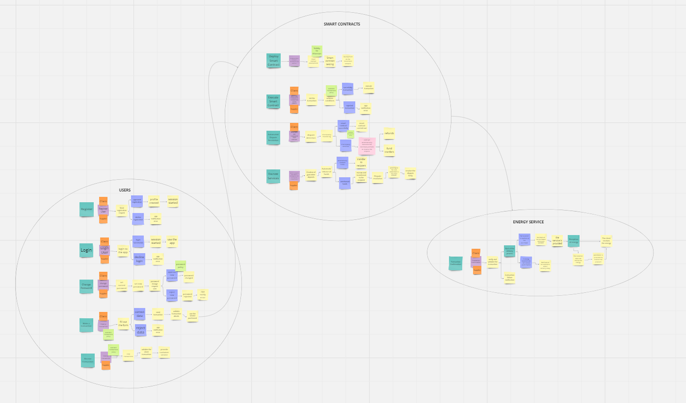

Link:
<https://miro.com/app/board/uXjVKXcfalY=/?share_link_id=881832001235>

4.2.2. Candidate Context Discovery.

Primero, se colocan los eventos de nuestra aplicación:

Luego, se ordenan en forma secuencial

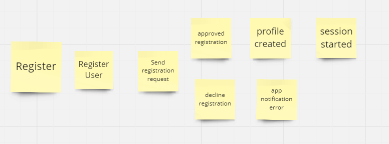

Después, se buscan eventos que cambien el estado del proceso

Se añaden también comandos, políticas y servicios externos

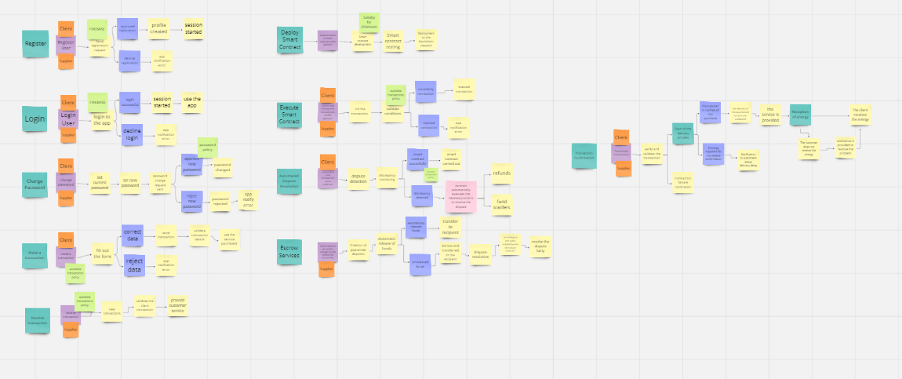

Finalmente se definen los bounded context

4.2.3. Domain Message Flows Modeling.

Link:
<https://miro.com/app/board/uXjVKWqPcwI=/?share_link_id=428508512685>

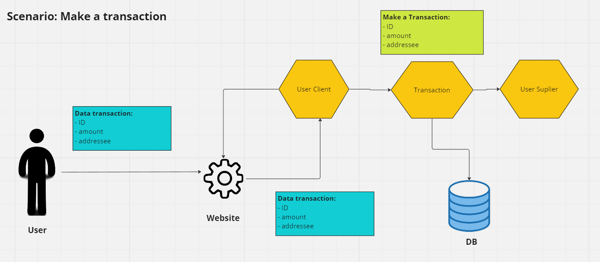

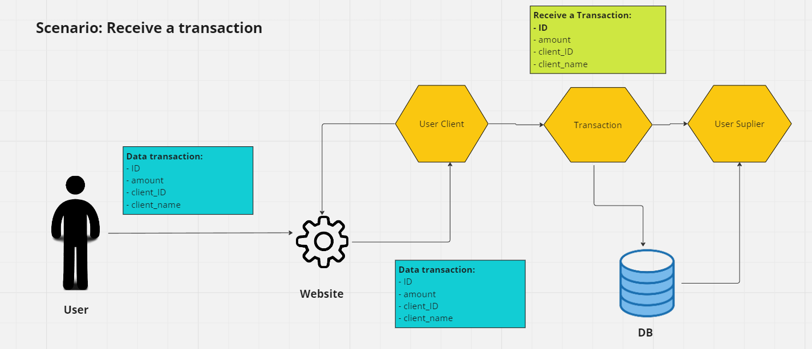

4.2.4. Bounded Context Canvases.

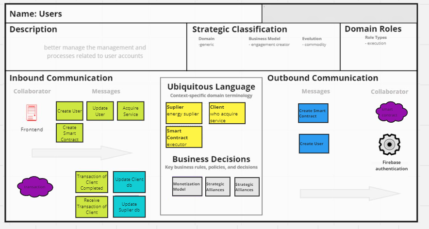

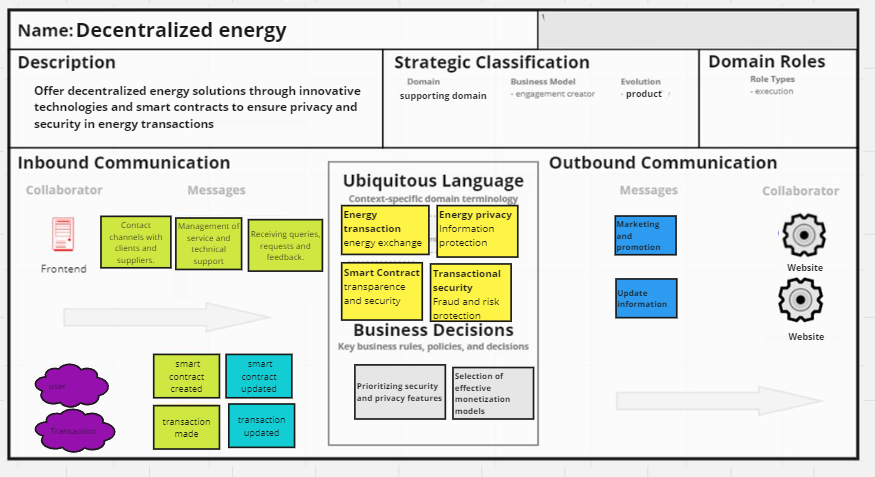

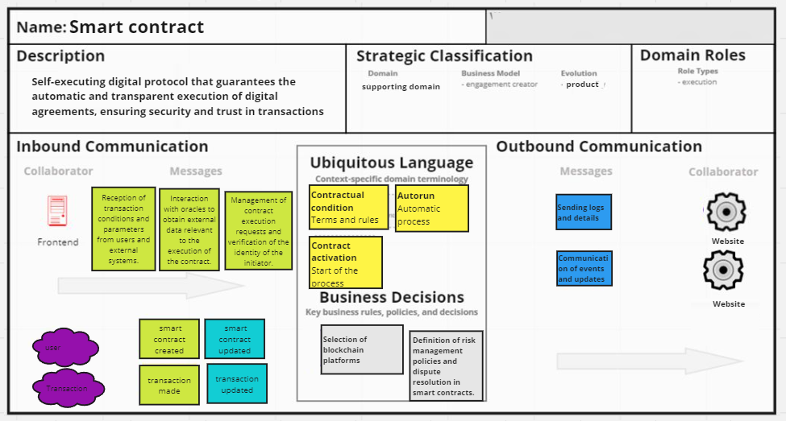

4.2.5. Context Mapping.

4.3. Software Architecture.

4.3.1. Software Architecture System Landscape Diagram.

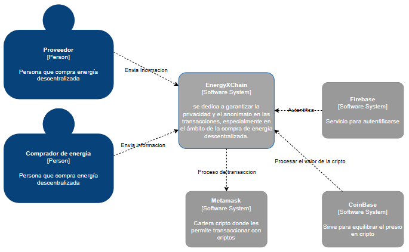

4.3.2. Software Architecture Context Level Diagrams.

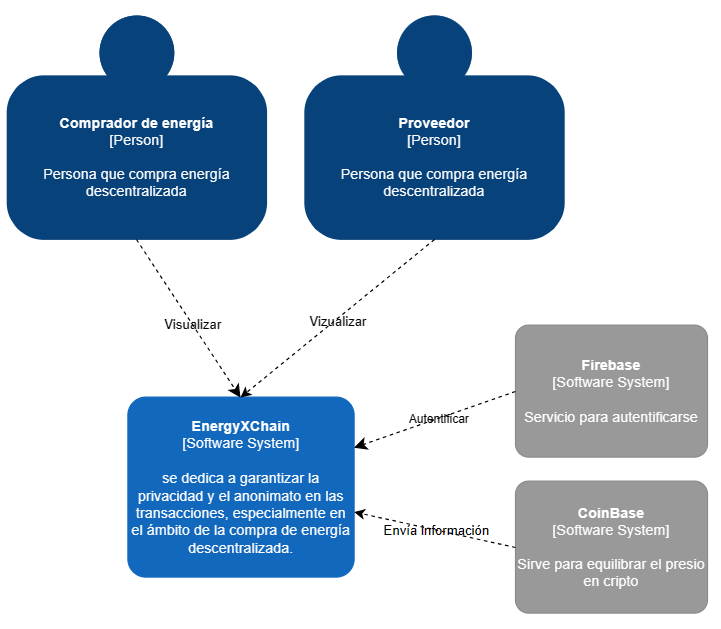

4.3.3. Software Architecture Container Level Diagrams.

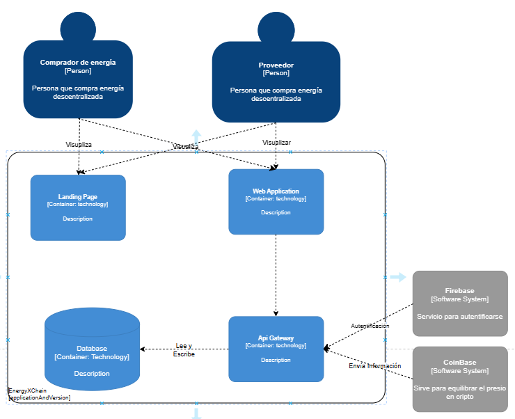

4.3.4. Software Architecture Deployment Diagrams

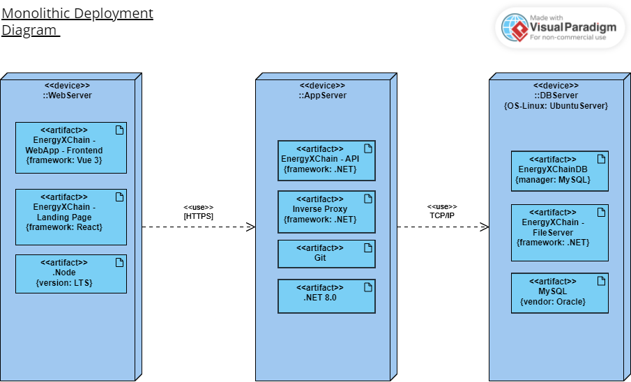

Capítulo V: Tactical-Level Software Design.

5.1. Bounded Context: User Bounded Context

<table>
<colgroup>
<col style="width: 22%" />
<col style="width: 15%" />
<col style="width: 19%" />
<col style="width: 21%" />
<col style="width: 21%" />
</colgroup>
<thead>
<tr class="header">
<th><blockquote>

Nombre

</blockquote></th>
<th colspan="3"><blockquote>

User

</blockquote></th>
<th></th>
</tr>
</thead>
<tbody>
<tr class="odd">
<td><blockquote>

Descripción

</blockquote></td>
<td colspan="3"><blockquote>

Representa al usuario que brinda el servicio de energía
descentralizada.

</blockquote></td>
<td></td>
</tr>
<tr class="even">
<td colspan="2"><blockquote>

Atributos

</blockquote></td>
<td colspan="2"><blockquote>

Relaciones

</blockquote></td>
<td rowspan="2"><blockquote>

Métodos

</blockquote></td>
</tr>
<tr class="odd">
<td><blockquote>

Nombre

</blockquote></td>
<td><blockquote>

Tipo de Dato

</blockquote></td>
<td><blockquote>

Tipo

</blockquote></td>
<td><blockquote>

Clases/Enums

</blockquote></td>
</tr>
<tr class="even">
<td><blockquote>

id

</blockquote></td>
<td><blockquote>

Integer

</blockquote></td>
<td></td>
<td></td>
<td></td>
</tr>
<tr class="odd">
<td><blockquote>

name

</blockquote></td>
<td><blockquote>

String

</blockquote></td>
<td></td>
<td></td>
<td></td>
</tr>
<tr class="even">
<td><blockquote>

age

</blockquote></td>
<td><blockquote>

Integer

</blockquote></td>
<td></td>
<td></td>
<td></td>
</tr>
<tr class="odd">
<td><blockquote>

email

</blockquote></td>
<td><blockquote>

String

</blockquote></td>
<td></td>
<td></td>
<td></td>
</tr>
<tr class="even">
<td><blockquote>

phoneNumber

</blockquote></td>
<td><blockquote>

String

</blockquote></td>
<td></td>
<td></td>
<td></td>
</tr>
<tr class="odd">
<td><blockquote>

typeUser

</blockquote></td>
<td><blockquote>

String

</blockquote></td>
<td></td>
<td></td>
<td></td>
</tr>
<tr class="even">
<td><blockquote>

password

</blockquote></td>
<td><blockquote>

String

</blockquote></td>
<td></td>
<td></td>
<td></td>
</tr>
</tbody>
</table>

<table>
<colgroup>
<col style="width: 18%" />
<col style="width: 12%" />
<col style="width: 12%" />
<col style="width: 15%" />
<col style="width: 17%" />
<col style="width: 23%" />
</colgroup>
<thead>
<tr class="header">
<th colspan="2"><blockquote>

Nombre

</blockquote></th>
<th colspan="3"><blockquote>

Suplier

</blockquote></th>
<th></th>
</tr>
</thead>
<tbody>
<tr class="odd">
<td colspan="2"><blockquote>

Descripción

</blockquote></td>
<td colspan="3"><blockquote>

Representa al usuario que brinda el servicio de energía
descentralizada.

</blockquote></td>
<td></td>
</tr>
<tr class="even">
<td colspan="3"><blockquote>

Atributos

</blockquote></td>
<td colspan="2"><blockquote>

Relaciones

</blockquote></td>
<td rowspan="2"><blockquote>

Métodos

</blockquote></td>
</tr>
<tr class="odd">
<td colspan="2"><blockquote>

Nombre

</blockquote></td>
<td><blockquote>

Tipo de Dato

</blockquote></td>
<td><blockquote>

Tipo

</blockquote></td>
<td><blockquote>

Clases/Enums

</blockquote></td>
</tr>
<tr class="even">
<td colspan="2"><blockquote>

id

</blockquote></td>
<td><blockquote>

Integer

</blockquote></td>
<td><blockquote>

Agregación

</blockquote></td>
<td><blockquote>

electricServiceId

</blockquote></td>
<td><blockquote>

CreateUser()

</blockquote></td>
</tr>
<tr class="odd">
<td colspan="2"><blockquote>

uID

</blockquote></td>
<td><blockquote>

String

</blockquote></td>
<td><blockquote>

Composición

</blockquote></td>
<td><blockquote>

electricCentralId

</blockquote></td>
<td><blockquote>

UpdateUser()

</blockquote></td>
</tr>
<tr class="even">
<td colspan="2"><blockquote>

userID

</blockquote></td>
<td><blockquote>

Integer

</blockquote></td>
<td><blockquote>

Dependency

</blockquote></td>
<td><blockquote>

transactionId

</blockquote></td>
<td><blockquote>

DeleteUser()

</blockquote></td>
</tr>
<tr class="odd">
<td colspan="2"><blockquote>

electricServiceId

</blockquote></td>
<td><blockquote>

integer

</blockquote></td>
<td></td>
<td></td>
<td><blockquote>

CreateEnergyService()

</blockquote></td>
</tr>
<tr class="even">
<td><blockquote>

electricCentralId

</blockquote></td>
<td><blockquote>

integer

</blockquote></td>
<td colspan="2"></td>
<td></td>
<td><blockquote>

UpdateEnergyService()

</blockquote></td>
</tr>
<tr class="odd">
<td colspan="2"></td>
<td></td>
<td></td>
<td></td>
<td><blockquote>

DeleteEnergyService()

</blockquote></td>
</tr>
</tbody>
</table>

<table>
<colgroup>
<col style="width: 20%" />
<col style="width: 14%" />
<col style="width: 17%" />
<col style="width: 19%" />
<col style="width: 26%" />
</colgroup>
<thead>
<tr class="header">
<th><blockquote>

Nombre

</blockquote></th>
<th colspan="3"><blockquote>

Client

</blockquote></th>
<th></th>
</tr>
</thead>
<tbody>
<tr class="odd">
<td><blockquote>

Descripción

</blockquote></td>
<td colspan="3"><blockquote>

Representa al usuario que adquiere el servicio de energía
descentralizada.

</blockquote></td>
<td></td>
</tr>
<tr class="even">
<td colspan="2"><blockquote>

Atributos

</blockquote></td>
<td colspan="2"><blockquote>

Relaciones

</blockquote></td>
<td rowspan="2"><blockquote>

Métodos

</blockquote></td>
</tr>
<tr class="odd">
<td><blockquote>

Nombre

</blockquote></td>
<td><blockquote>

Tipo de Dato

</blockquote></td>
<td><blockquote>

Tipo

</blockquote></td>
<td><blockquote>

Clases/Enums

</blockquote></td>
</tr>
<tr class="even">
<td><blockquote>

id

</blockquote></td>
<td><blockquote>

Integer

</blockquote></td>
<td><blockquote>

Agregación

</blockquote></td>
<td><blockquote>

electricServiceId

</blockquote></td>
<td><blockquote>

CreateUser()

</blockquote></td>
</tr>
<tr class="odd">
<td><blockquote>

uID

</blockquote></td>
<td><blockquote>

String

</blockquote></td>
<td></td>
<td></td>
<td><blockquote>

UpdateUser()

</blockquote></td>
</tr>
<tr class="even">
<td><blockquote>

userId

</blockquote></td>
<td><blockquote>

Integer

</blockquote></td>
<td></td>
<td></td>
<td><blockquote>

DeleteUser()

</blockquote></td>
</tr>
<tr class="odd">
<td><blockquote>

ElectricServiceId

</blockquote></td>
<td><blockquote>

Integer

</blockquote></td>
<td></td>
<td></td>
<td><blockquote>

CreateElectricService()

</blockquote></td>
</tr>
<tr class="even">
<td></td>
<td></td>
<td></td>
<td></td>
<td><blockquote>

DeleteElectricService()

</blockquote></td>
</tr>
<tr class="odd">
<td></td>
<td></td>
<td></td>
<td></td>
<td><blockquote>

DeleteElectricService()

</blockquote></td>
</tr>
</tbody>
</table>

<table>
<colgroup>
<col style="width: 31%" />
<col style="width: 68%" />
</colgroup>
<thead>
<tr class="header">
<th><blockquote>

Nombre

</blockquote></th>
<th><blockquote>

TypeUser

</blockquote></th>
</tr>
</thead>
<tbody>
<tr class="odd">
<td><blockquote>

Descripción

</blockquote></td>
<td><blockquote>

Representar la el tipo de usuario

</blockquote></td>
</tr>
<tr class="even">
<td colspan="2"><blockquote>

Valores

</blockquote></td>
</tr>
<tr class="odd">
<td colspan="2"><blockquote>

Suplier

</blockquote></td>
</tr>
<tr class="even">
<td colspan="2"><blockquote>

Client

</blockquote></td>
</tr>
</tbody>
</table>

5.1.1. Domain Layer.

Se identificó que las clase que forman parte del core del negocio son
las clases ElectricService, ElectricCentral y Transaction, los cuales el
usuario podrá realizar la creación de servicios de energía, como también
podrá realizar smart contracts para tener un contrato seguro entre el
usuario cliente y el usuario proveedor.

**Entidades:**

ElectricService(Agregate): Es la representación del servicio de energía.

ElectricCentral(Composición): Es la representación de la central de
electricidad.

Transaction(Dependency): Es la representación de las transacciones para
los pagos.

**Value Objects:**

uId: Es la representación del identificador de la autenticación del
usuario

ElectricServiceId(Agregate): Es la representación del identificador del
servicio de energía.

ElectricCentralId(Agregate): Es la representación del identificador de
la central de electricidad.

TransactionId(Dependency): Es la representación del identificador de las
transacciones para los pagos.

**Enums:**

name: Es la representación del nombre del usuario.

email: Es la representación del correo electrónico del usuario.

phonNumber: Es la representación del número telefónico del usuario

age: Es la representación de la edad del usuario

typeUser: Es la representación del tipo de usuario

password: Es la representación de la contraseña

**Factories:**

UserFactory: Ayuda a la creación del usuario.

**Interfaces:**

IUserRepository: interfaz de la clase UserRepository.

<table>
<colgroup>
<col style="width: 31%" />
<col style="width: 68%" />
</colgroup>
<thead>
<tr class="header">
<th><blockquote>

<strong>Nombre</strong>

</blockquote></th>
<th>IUserRepository</th>
</tr>
</thead>
<tbody>
<tr class="odd">
<td><blockquote>

<strong>Descripción</strong>

</blockquote></td>
<td><blockquote>

<strong>Permite la conexión con la base de datos</strong>

</blockquote></td>
</tr>
<tr class="even">
<td colspan="2"><blockquote>

<strong>Métodos</strong>

</blockquote></td>
</tr>
<tr class="odd">
<td colspan="2"><blockquote>

<strong>findAll()</strong>

</blockquote></td>
</tr>
<tr class="even">
<td colspan="2"><blockquote>

<strong>findById()</strong>

</blockquote></td>
</tr>
<tr class="odd">
<td colspan="2"><blockquote>

<strong>findByUserSuplierById()</strong>

</blockquote></td>
</tr>
<tr class="even">
<td colspan="2"><blockquote>

<strong>findByUserClientById()</strong>

</blockquote></td>
</tr>
<tr class="odd">
<td colspan="2"><blockquote>

<strong>create()</strong>

</blockquote></td>
</tr>
<tr class="even">
<td colspan="2"><blockquote>

<strong>update()</strong>

</blockquote></td>
</tr>
<tr class="odd">
<td colspan="2"><blockquote>

<strong>delete()</strong>

</blockquote></td>
</tr>
</tbody>
</table>

**IUserServices: interfaz de la clase UserServices, ayuda a mantener un
bajo acoplamiento.**

<table>
<colgroup>
<col style="width: 31%" />
<col style="width: 68%" />
</colgroup>
<thead>
<tr class="header">
<th><blockquote>

<strong>Nombre</strong>

</blockquote></th>
<th><blockquote>

<strong>IUserService</strong>

</blockquote></th>
</tr>
</thead>
<tbody>
<tr class="odd">
<td><blockquote>

<strong>Descripción</strong>

</blockquote></td>
<td><blockquote>

<strong>Declara las funciones que contiene las reglas de
negocio</strong>

</blockquote></td>
</tr>
<tr class="even">
<td colspan="2"><blockquote>

<strong>Métodos</strong>

</blockquote></td>
</tr>
<tr class="odd">
<td colspan="2"><blockquote>

<strong>getAll()</strong>

</blockquote></td>
</tr>
<tr class="even">
<td colspan="2"><blockquote>

<strong>geById()</strong>

</blockquote></td>
</tr>
<tr class="odd">
<td colspan="2"><blockquote>

<strong>findByUserSuplierById()</strong>

</blockquote></td>
</tr>
<tr class="even">
<td colspan="2"><blockquote>

<strong>findByUserClientById()</strong>

</blockquote></td>
</tr>
<tr class="odd">
<td colspan="2"><blockquote>

<strong>create()</strong>

</blockquote></td>
</tr>
<tr class="even">
<td colspan="2"><blockquote>

<strong>delete()</strong>

</blockquote></td>
</tr>
<tr class="odd">
<td colspan="2"><blockquote>

<strong>apply()</strong>

</blockquote></td>
</tr>
<tr class="even">
<td colspan="2"><blockquote>

<strong>enable()</strong>

</blockquote></td>
</tr>
<tr class="odd">
<td colspan="2"><blockquote>

<strong>disable()</strong>

</blockquote></td>
</tr>
<tr class="even">
<td colspan="2"><blockquote>

<strong>update()</strong>

</blockquote></td>
</tr>
</tbody>
</table>

5.1.2. Interface Layer.

En esta sección se presentan las interfaces que serán implementadas por
la aplicación para realizar los cambios respectivos al servicio de
energía.

**IUserController:**

Define las funciones que reciben las solicitudes relacionadas a la
administración de los usuarios.

<table>
<colgroup>
<col style="width: 31%" />
<col style="width: 68%" />
</colgroup>
<thead>
<tr class="header">
<th><blockquote>

Nombre

</blockquote></th>
<th>IUserController</th>
</tr>
</thead>
<tbody>
<tr class="odd">
<td><blockquote>

Descripción

</blockquote></td>
<td><blockquote>

Define las funciones que reciben las solicitudes relacionadas a la
administración de los usuarios.

</blockquote></td>
</tr>
<tr class="even">
<td colspan="2"><blockquote>

Métodos

</blockquote></td>
</tr>
<tr class="odd">
<td colspan="2"><blockquote>

getAll()

</blockquote></td>
</tr>
<tr class="even">
<td colspan="2"><blockquote>

geById()

</blockquote></td>
</tr>
<tr class="odd">
<td colspan="2"><blockquote>

findByUserSuplierById()

</blockquote></td>
</tr>
<tr class="even">
<td colspan="2"><blockquote>

findByUserClientById()

</blockquote></td>
</tr>
<tr class="odd">
<td colspan="2"><blockquote>

create()

</blockquote></td>
</tr>
<tr class="even">
<td colspan="2"><blockquote>

delete()

</blockquote></td>
</tr>
<tr class="odd">
<td colspan="2"><blockquote>

apply()

</blockquote></td>
</tr>
<tr class="even">
<td colspan="2"><blockquote>

enable()

</blockquote></td>
</tr>
<tr class="odd">
<td colspan="2"><blockquote>

disable()

</blockquote></td>
</tr>
<tr class="even">
<td colspan="2"><blockquote>

update()

</blockquote></td>
</tr>
</tbody>
</table>

5.1.3. Application Layer.

En esta sección presentamos los commandHandlers y EventHandlers
encargados de manejar los comandos y eventos respectivos tras las
solicitudes realizadas a las implementaciones de las interfaces del ítem
anterior.

CreateUserCommandHandler: Maneja el comando del usuario

EnergyUserEventHandler: Maneja el evento del usuario

5.1.4. Infrastructure Layer.

En esta sección presentamos las clases que se encargan de conectar con
servicios externos:

**UserRepository:** Establece la conexión del componente User con la
base de datos, permitiendo el intercambio de datos entre ambas partes

5.1.5. Bounded Context Software Architecture Component Level Diagrams.

A continuación, presentamos el component level diagram considerado para
el bounded context de Usuario:

Link:<https://drive.google.com/file/d/1-waK4zRniGlz9gGxGq6Z1mU0Vw_7xrz9/view?usp=sharing>

5.1.6. Bounded Context Software Architecture Code Level Diagrams.

5.1.6.1. Bounded Context Domain Layer Class Diagrams.

Link:
<https://lucid.app/lucidchart/96f40478-1d8f-4fce-b7b2-5771058ccecb/edit?viewport_loc=-1128%2C-66%2C3236%2C1735%2C0_0&invitationId=inv_3de9e653-783b-4e6e-bdd5-bcd7faecc068>

5.1.6.2. Bounded Context Database Design Diagram.

Link:
<https://my.vertabelo.com/logical/model/cP2umt6SsJXJHhN6uKCDCtsDhumBmWko>

5.2. Bounded Context: Energy Service

| Nombre      | Energy Service                                            |            |              |                        |
|-------------|-----------------------------------------------------------|------------|--------------|------------------------|
| Descripción | Encargada del servicio de envió de energía y notificación |            |              |                        |
| Atributos   |                                                           | Relaciones |              | Métodos                |
| Nombre      | Tipo de Dato                                              | Tipo       | Clases/Enums |                        |
| id          | Integer                                                   |            |              | sendNotification()     |
| clientId    | ClientId                                                  | Agregación | Client       |                        |
| supplierId  | SupplierId                                                | Agregación | Supplier     | notificationCustomer() |
| description | String                                                    |            |              |                        |
| price       | Float                                                     |            |              |                        |
| location    | String                                                    |            |              |                        |
| createdAt   | Date                                                      |            |              |                        |

| Nombre         | Transaction                                                |             |              |          |
|----------------|------------------------------------------------------------|-------------|--------------|----------|
| Descripción    | Encargada del servicio pagos y verificación de transacción |             |              |          |
| Atributos      |                                                            | Relaciones  |              | Métodos  |
| Nombre         | Tipo de Dato                                               | Tipo        | Clases/Enums |          |
| id             | Integer                                                    |             |              | verify() |
| supplierId     | SupplierId                                                 | Dependencia | Supplier     |          |
| totalMount     | Float                                                      |             |              |          |
| date           | DateTime                                                   |             |              |          |
| typeCrytocurre | String                                                     |             |              |          |

5.2.1. Domain Layer.

Se identificó que las clase que forman parte del core del negocio son
las clases ElectricService y Transaction, los cuales el usuario podrá
realizar la creación de servicios de energía, como también podrá
notificar y verificar el estado del pedido.

Adicional se identifico clases complementarias como Client y Supplier

**Entidades:**

ElectricService: Es la representación del servicio de energía .

Transaction: Es la representación de las transacciones para los pagos

Client: Es la representación del cliente

Supplier:Es la representación de nuestro ofrecedor del servicio

**Value Objects:**

ElectricServiceId: Es la representación del identificador del servicio
de energía.

TransactionId: Es la representación del identificador de las
transacciones para los pagos.

**Enums:**

Description: Es la representación de la descripción del servicio.

Price: Es la representación del precio por el servicio.

Location: Es la representación de la ubicación donde se brinda el
servicio.

CreatedAt: Es la representación de cuando comenzó el servicio.

TotalMount: Es la representación de que si se realizo la transacción.

Date: Es la representación de cuando se realizo la transacción.

TypeCryptocurre: Es la representación de cual fue la criptomoneda que se
uso.

**Factories:**

ElectricServiceFactory: Ayuda a la creación del servicio de energía.

TransactionFactory: Ayuda a la creación de la transacción

**Interfaces:**

IElectricServiceRepository: interfaz de la clase
EnergyServiceRepository.

ITransactionRepository: interfaz de la clase TransactionRepository.

<table>
<colgroup>
<col style="width: 25%" />
<col style="width: 74%" />
</colgroup>
<thead>
<tr class="header">
<th><blockquote>

<strong>Nombre</strong>

</blockquote></th>
<th>IElectricServiceRepository</th>
</tr>
</thead>
<tbody>
<tr class="odd">
<td><blockquote>

<strong>Descripción</strong>

</blockquote></td>
<td><blockquote>

<strong>Permite la conexión con la base de datos</strong>

</blockquote></td>
</tr>
<tr class="even">
<td colspan="2"><blockquote>

<strong>Métodos</strong>

</blockquote></td>
</tr>
<tr class="odd">
<td colspan="2"><blockquote>

<strong>findAll()</strong>

</blockquote></td>
</tr>
<tr class="even">
<td colspan="2"><blockquote>

<strong>findById()</strong>

</blockquote></td>
</tr>
<tr class="odd">
<td colspan="2"><blockquote>

<strong>findByUserSuplierById()</strong>

</blockquote></td>
</tr>
<tr class="even">
<td colspan="2"><blockquote>

<strong>create()</strong>

</blockquote></td>
</tr>
<tr class="odd">
<td colspan="2"><blockquote>

<strong>update()</strong>

</blockquote></td>
</tr>
<tr class="even">
<td colspan="2"><blockquote>

<strong>delete()</strong>

</blockquote></td>
</tr>
</tbody>
</table>

<table>
<colgroup>
<col style="width: 25%" />
<col style="width: 74%" />
</colgroup>
<thead>
<tr class="header">
<th><blockquote>

<strong>Nombre</strong>

</blockquote></th>
<th>ITransactionRepository</th>
</tr>
</thead>
<tbody>
<tr class="odd">
<td><blockquote>

<strong>Descripción</strong>

</blockquote></td>
<td><blockquote>

<strong>Permite la conexión con la base de datos</strong>

</blockquote></td>
</tr>
<tr class="even">
<td colspan="2"><blockquote>

<strong>Métodos</strong>

</blockquote></td>
</tr>
<tr class="odd">
<td colspan="2"><blockquote>

<strong>findAll()</strong>

</blockquote></td>
</tr>
<tr class="even">
<td colspan="2"><blockquote>

<strong>findById()</strong>

</blockquote></td>
</tr>
<tr class="odd">
<td colspan="2"><blockquote>

<strong>findByUserSupplierById()</strong>

</blockquote></td>
</tr>
<tr class="even">
<td colspan="2"><blockquote>

<strong>create()</strong>

</blockquote></td>
</tr>
<tr class="odd">
<td colspan="2"><blockquote>

<strong>update()</strong>

</blockquote></td>
</tr>
<tr class="even">
<td colspan="2"><blockquote>

<strong>delete()</strong>

</blockquote></td>
</tr>
</tbody>
</table>

**IElectricServiceServices: interfaz de la clase EnergyServiceServices,
ayuda a mantener un bajo acoplamiento.**

<table>
<colgroup>
<col style="width: 19%" />
<col style="width: 80%" />
</colgroup>
<thead>
<tr class="header">
<th><blockquote>

<strong>Nombre</strong>

</blockquote></th>
<th><blockquote>

<strong>IElectricServiceService</strong>

</blockquote></th>
</tr>
</thead>
<tbody>
<tr class="odd">
<td><blockquote>

<strong>Descripción</strong>

</blockquote></td>
<td><blockquote>

<strong>Declara las funciones que contiene las reglas de
negocio</strong>

</blockquote></td>
</tr>
<tr class="even">
<td colspan="2"><blockquote>

<strong>Métodos</strong>

</blockquote></td>
</tr>
<tr class="odd">
<td colspan="2"><blockquote>

<strong>getAll()</strong>

</blockquote></td>
</tr>
<tr class="even">
<td colspan="2"><blockquote>

<strong>geById()</strong>

</blockquote></td>
</tr>
<tr class="odd">
<td colspan="2"><blockquote>

<strong>getByUserSuplierById()</strong>

</blockquote></td>
</tr>
<tr class="even">
<td colspan="2"><blockquote>

<strong>create()</strong>

</blockquote></td>
</tr>
<tr class="odd">
<td colspan="2"><blockquote>

<strong>delete()</strong>

</blockquote></td>
</tr>
<tr class="even">
<td colspan="2"><blockquote>

<strong>apply()</strong>

</blockquote></td>
</tr>
<tr class="odd">
<td colspan="2"><blockquote>

<strong>enable()</strong>

</blockquote></td>
</tr>
<tr class="even">
<td colspan="2"><blockquote>

<strong>disable()</strong>

</blockquote></td>
</tr>
<tr class="odd">
<td colspan="2"><blockquote>

<strong>update()</strong>

</blockquote></td>
</tr>
</tbody>
</table>

**TransactionServices: interfaz de la clase TransactionServices, ayuda a
mantener un bajo acoplamiento.**

<table>
<colgroup>
<col style="width: 19%" />
<col style="width: 80%" />
</colgroup>
<thead>
<tr class="header">
<th><blockquote>

<strong>Nombre</strong>

</blockquote></th>
<th><blockquote>

<strong>ITransactionService</strong>

</blockquote></th>
</tr>
</thead>
<tbody>
<tr class="odd">
<td><blockquote>

<strong>Descripción</strong>

</blockquote></td>
<td><blockquote>

<strong>Declara las funciones que contiene las reglas de
negocio</strong>

</blockquote></td>
</tr>
<tr class="even">
<td colspan="2"><blockquote>

<strong>Métodos</strong>

</blockquote></td>
</tr>
<tr class="odd">
<td colspan="2"><blockquote>

<strong>getAll()</strong>

</blockquote></td>
</tr>
<tr class="even">
<td colspan="2"><blockquote>

<strong>geById()</strong>

</blockquote></td>
</tr>
<tr class="odd">
<td colspan="2"><blockquote>

<strong>getByUserSupplierById()</strong>

</blockquote></td>
</tr>
<tr class="even">
<td colspan="2"><blockquote>

<strong>create()</strong>

</blockquote></td>
</tr>
<tr class="odd">
<td colspan="2"><blockquote>

<strong>delete()</strong>

</blockquote></td>
</tr>
<tr class="even">
<td colspan="2"><blockquote>

<strong>apply()</strong>

</blockquote></td>
</tr>
<tr class="odd">
<td colspan="2"><blockquote>

<strong>enable()</strong>

</blockquote></td>
</tr>
<tr class="even">
<td colspan="2"><blockquote>

<strong>disable()</strong>

</blockquote></td>
</tr>
<tr class="odd">
<td colspan="2"><blockquote>

<strong>update()</strong>

</blockquote></td>
</tr>
</tbody>
</table>

5.2.2. Interface Layer.

En esta sección se presentan las interfaces que serán implementadas por
la aplicación para realizar los cambios respectivos al servicio de
energía.

**IElectricServiceController:**

Define las funciones que reciben las solicitudes relacionadas a la
administración de los servicios de energía.

<table>
<colgroup>
<col style="width: 10%" />
<col style="width: 89%" />
</colgroup>
<thead>
<tr class="header">
<th><blockquote>

Nombre

</blockquote></th>
<th>IElectricServiceController</th>
</tr>
</thead>
<tbody>
<tr class="odd">
<td><blockquote>

Descripción

</blockquote></td>
<td><blockquote>

Define las funciones que reciben las solicitudes relacionadas a la
administración de los servicios de energía.

</blockquote></td>
</tr>
<tr class="even">
<td colspan="2"><blockquote>

Métodos

</blockquote></td>
</tr>
<tr class="odd">
<td colspan="2"><blockquote>

getAll()

</blockquote></td>
</tr>
<tr class="even">
<td colspan="2"><blockquote>

geById()

</blockquote></td>
</tr>
<tr class="odd">
<td colspan="2"><blockquote>

getByUserSuplierById()

</blockquote></td>
</tr>
<tr class="even">
<td colspan="2"><blockquote>

create()

</blockquote></td>
</tr>
<tr class="odd">
<td colspan="2"><blockquote>

delete()

</blockquote></td>
</tr>
<tr class="even">
<td colspan="2"><blockquote>

apply()

</blockquote></td>
</tr>
<tr class="odd">
<td colspan="2"><blockquote>

enable()

</blockquote></td>
</tr>
<tr class="even">
<td colspan="2"><blockquote>

disable()

</blockquote></td>
</tr>
<tr class="odd">
<td colspan="2"><blockquote>

update()

</blockquote></td>
</tr>
</tbody>
</table>

**ITransactionController:**

Define las funciones que reciben las solicitudes relacionadas a la
administración de las transacciones.

<table>
<colgroup>
<col style="width: 10%" />
<col style="width: 89%" />
</colgroup>
<thead>
<tr class="header">
<th><blockquote>

Nombre

</blockquote></th>
<th>ITransactionController</th>
</tr>
</thead>
<tbody>
<tr class="odd">
<td><blockquote>

Descripción

</blockquote></td>
<td><blockquote>

Define las funciones que reciben las solicitudes relacionadas a la
administración de las transacciones

</blockquote></td>
</tr>
<tr class="even">
<td colspan="2"><blockquote>

Métodos

</blockquote></td>
</tr>
<tr class="odd">
<td colspan="2"><blockquote>

getAll()

</blockquote></td>
</tr>
<tr class="even">
<td colspan="2"><blockquote>

geById()

</blockquote></td>
</tr>
<tr class="odd">
<td colspan="2"><blockquote>

getByUserSupplierById()

</blockquote></td>
</tr>
<tr class="even">
<td colspan="2"><blockquote>

create()

</blockquote></td>
</tr>
<tr class="odd">
<td colspan="2"><blockquote>

delete()

</blockquote></td>
</tr>
<tr class="even">
<td colspan="2"><blockquote>

apply()

</blockquote></td>
</tr>
<tr class="odd">
<td colspan="2"><blockquote>

enable()

</blockquote></td>
</tr>
<tr class="even">
<td colspan="2"><blockquote>

disable()

</blockquote></td>
</tr>
<tr class="odd">
<td colspan="2"><blockquote>

update()

</blockquote></td>
</tr>
</tbody>
</table>

5.2.3. Application Layer.

En esta sección presentamos los commandHandlers y EventHandlers
encargados de manejar los comandos y eventos respectivos tras las
solicitudes realizadas a las implementaciones de las interfaces del ítem
anterior.

**CreateEnergyServiceCommandHandler**: Maneja el comando del servicio de
energía

**ElectricServiceCreatedEventHandler**: Maneja el evento del servicio de
energía creada

**CreateTransactionCommandHandler**: Maneja el comando de la
transacción.

**TransactionCreatedEventHandler**: Maneja el evento de la transacción.

5.2.4. Infrastructure Layer.

En esta sección presentamos las clases que se encargan de conectar con
servicios externos:

**ElectricServiceRepository**: Establece la conexión del componente
ElectricService con la base de datos, permitiendo el intercambio de
datos entre ambas partes

**TransactionRepository**: Establece la conexión del componente
Transaction con la base de datos, permitiendo el intercambio de datos
entre ambas partes

5.2.6. Bounded Context Software Architecture Component Level Diagrams.

5.2.7. Bounded Context Software Architecture Code Level Diagrams.

Link:
<https://lucid.app/lucidchart/96f40478-1d8f-4fce-b7b2-5771058ccecb/edit?viewport_loc=-1128%2C-66%2C3236%2C1735%2C0_0&invitationId=inv_3de9e653-783b-4e6e-bdd5-bcd7faecc068>

5.1.6.2. Bounded Context Database Design Diagram.

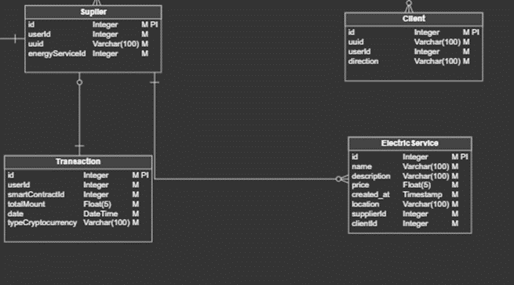

Link:
<https://my.vertabelo.com/logical/model/cP2umt6SsJXJHhN6uKCDCtsDhumBmWko>

5.3. Bounded Context: Smart Contract Bounded Context

<table>
<colgroup>
<col style="width: 20%" />
<col style="width: 14%" />
<col style="width: 17%" />
<col style="width: 19%" />
<col style="width: 26%" />
</colgroup>
<thead>
<tr class="header">
<th><blockquote>

Nombre

</blockquote></th>
<th colspan="3"><blockquote>

Transaction

</blockquote></th>
<th></th>
</tr>
</thead>
<tbody>
<tr class="odd">
<td><blockquote>

Descripción

</blockquote></td>
<td colspan="3"><blockquote>

Encargada del servicio pagos y verificación de transacción

</blockquote></td>
<td></td>
</tr>
<tr class="even">
<td colspan="2"><blockquote>

Atributos

</blockquote></td>
<td colspan="2"><blockquote>

Relaciones

</blockquote></td>
<td rowspan="2"><blockquote>

Métodos

</blockquote></td>
</tr>
<tr class="odd">
<td><blockquote>

Nombre

</blockquote></td>
<td><blockquote>

Tipo de Dato

</blockquote></td>
<td><blockquote>

Tipo

</blockquote></td>
<td><blockquote>

Clases/Enums

</blockquote></td>
</tr>
<tr class="even">
<td><blockquote>

id

</blockquote></td>
<td><blockquote>

Integer

</blockquote></td>
<td></td>
<td></td>
<td><blockquote>

verify()

</blockquote></td>
</tr>
<tr class="odd">
<td><blockquote>

supplierId

</blockquote></td>
<td><blockquote>

String

</blockquote></td>
<td>Dependency</td>
<td>Supplier</td>
<td></td>
</tr>
<tr class="even">
<td><blockquote>

totalMount

</blockquote></td>
<td><blockquote>

Integer

</blockquote></td>
<td></td>
<td></td>
<td></td>
</tr>
<tr class="odd">
<td><blockquote>

date

</blockquote></td>
<td><blockquote>

Integer

</blockquote></td>
<td></td>
<td></td>
<td></td>
</tr>
<tr class="even">
<td>typeCryptocurrency</td>
<td>String</td>
<td></td>
<td></td>
<td></td>
</tr>
</tbody>
</table>

5.3.1. Domain Layer.

El Domain Layer del bounded context de Smart Contracts encapsula la
lógica de negocio fundamental relacionada con la creación, ejecución y
gestión de contratos inteligentes para transacciones de energía. Este
layer define las entidades clave como los contratos de energía, así como
los objetos de valor y enumeraciones asociados. Además, proporciona
interfaces para interactuar con los repositorios de datos y servicios
necesarios para la manipulación y gestión de los contratos inteligentes.
En resumen, el Domain Layer del bounded context de Smart Contracts se
centra en garantizar la seguridad, transparencia y eficiencia de las
transacciones de energía mediante la aplicación de contratos
inteligentes en un entorno digitalizado.

**Entidades:**

Contrato: Representa un acuerdo entre un proveedor y un consumidor de
energía. Contiene información como el ID del contrato, el ID del
proveedor, el ID del consumidor, la cantidad de energía, el precio por
unidad y el estado de la transacción.

**Value Objects:**

EnergyAmount: Representa una cantidad específica de energía, con un
valor numérico y una unidad de medida (por ejemplo, kilovatios).

PricePerUnit: Representa el precio por unidad de energía, con un valor
numérico y una unidad de moneda (por ejemplo, dólares).

**Enums:**

ContractType: Enumera los diferentes tipos de contratos que pueden ser
de compra o venta de energía.

TransactionStatus: Enumera los diferentes estados en los que puede
encontrarse una transacción, como pendiente, confirmada o cancelada.

**Factories:**

ContractFactory: Ayuda a la creación de instancias de contratos de
energía con diferentes parámetros y configuraciones.

**Interfaces:**

ContractRepository: Define operaciones para acceder y manipular datos
relacionados con los contratos de energía, como guardar, recuperar,
actualizar y eliminar contratos de una fuente de datos subyacente.

<table>
<colgroup>
<col style="width: 31%" />
<col style="width: 68%" />
</colgroup>
<thead>
<tr class="header">
<th><blockquote>

<strong>Nombre</strong>

</blockquote></th>
<th>ContractRepository</th>
</tr>
</thead>
<tbody>
<tr class="odd">
<td><blockquote>

<strong>Descripción</strong>

</blockquote></td>
<td><blockquote>

<strong>Interfaz para acceder y manipular datos de contratos de
energía.</strong>

</blockquote></td>
</tr>
<tr class="even">
<td colspan="2"><blockquote>

<strong>Métodos</strong>

</blockquote></td>
</tr>
<tr class="odd">
<td colspan="2"><blockquote>

<strong>findAll()</strong>

</blockquote></td>
</tr>
<tr class="even">
<td colspan="2"><blockquote>

<strong>findById()</strong>

</blockquote></td>
</tr>
<tr class="odd">
<td colspan="2"><blockquote>

<strong>findBySupplierId()</strong>

</blockquote></td>
</tr>
<tr class="even">
<td colspan="2"><blockquote>

<strong>findByConsumerId()</strong>

</blockquote></td>
</tr>
<tr class="odd">
<td colspan="2"><blockquote>

<strong>create()</strong>

</blockquote></td>
</tr>
<tr class="even">
<td colspan="2"><blockquote>

<strong>update()</strong>

</blockquote></td>
</tr>
<tr class="odd">
<td colspan="2"><blockquote>

<strong>delete()</strong>

</blockquote></td>
</tr>
</tbody>
</table>

**ContractService: Encapsula la lógica de negocio relacionada con los
contratos de energía. Proporciona métodos para crear, ejecutar y
gestionar contratos, incluyendo la verificación de la validez de los
contratos, el cálculo de tarifas y la gestión de transacciones.**

<table>
<colgroup>
<col style="width: 31%" />
<col style="width: 68%" />
</colgroup>
<thead>
<tr class="header">
<th><blockquote>

<strong>Nombre</strong>

</blockquote></th>
<th><blockquote>

<strong>ContractService</strong>

</blockquote></th>
</tr>
</thead>
<tbody>
<tr class="odd">
<td><blockquote>

<strong>Descripción</strong>

</blockquote></td>
<td><blockquote>

<strong>Encapsula la lógica de negocio relacionada con los contratos
de energía.</strong>

</blockquote></td>
</tr>
<tr class="even">
<td colspan="2"><blockquote>

<strong>Métodos</strong>

</blockquote></td>
</tr>
<tr class="odd">
<td colspan="2"><blockquote>

<strong>createContract()</strong>

</blockquote></td>
</tr>
<tr class="even">
<td colspan="2"><blockquote>

<strong>executeTransaction()</strong>

</blockquote></td>
</tr>
<tr class="odd">
<td colspan="2"><blockquote>

<strong>getContractById()</strong>

</blockquote></td>
</tr>
<tr class="even">
<td colspan="2"><blockquote>

<strong>cancelContract()</strong>

</blockquote></td>
</tr>
<tr class="odd">
<td colspan="2"><blockquote>

<strong>verifyContractValidity()</strong>

</blockquote></td>
</tr>
<tr class="even">
<td colspan="2"><blockquote>

<strong>getTransactionsByContractId()</strong>

</blockquote></td>
</tr>
</tbody>
</table>

5.3.2. Interface Layer.

5.3.3. Application Layer.

En el Application Layer del bounded context de Smart Contracts, se
definen los siguientes commandHandlers y EventHandlers encargados de
manejar los comandos y eventos respectivos.

**CreateContractCommandHandler:** Maneja el comando para crear un nuevo
contrato de energía.

Este commandHandler se encarga de procesar la solicitud de creación de
un nuevo contrato de energía. Recibe la información necesaria para crear
el contrato, como el ID del proveedor, el ID del consumidor, la cantidad
de energía y el precio por unidad.

**ContractCreatedEventHandler:** Maneja el evento de contrato creado.

Este EventHandler se activa después de que se haya creado con éxito un
nuevo contrato de energía. Puede realizar acciones adicionales, como
notificar a las partes involucradas o registrar el evento en un registro
de eventos.

**ExecuteTransactionCommandHandler:** Maneja el comando para ejecutar
una transacción de energía.

Este commandHandler se encarga de procesar la solicitud de ejecución de
una transacción de energía. Recibe la información necesaria para la
transacción, como el ID del contrato, la cantidad de energía a
transferir y los detalles de pago.

**TransactionExecutedEventHandler:** Maneja el evento de transacción
ejecutada.

Este EventHandler se activa después de que se haya ejecutado con éxito
una transacción de energía. Puede realizar acciones adicionales, como
actualizar el estado del contrato o registrar el evento en un registro
de eventos.

Estos commandHandlers y EventHandlers son parte integral del Application
Layer y se encargan de gestionar las solicitudes y eventos relacionados
con los contratos de energía en el contexto de Smart Contracts. Cada uno
tiene un propósito específico y contribuye al flujo general de la lógica
de negocio dentro del bounded context.

5.3.4. Infrastructure Layer.

5.3.5. Bounded Context Software Architecture Component Level Diagrams.

5.3.6. Bounded Context Software Architecture Code Level Diagrams.

5.3.6.1. Bounded Context Domain Layer Class Diagrams.

5.3.6.2. Bounded Context Database Design Diagram.

Capítulo VI: Solution UX Design

6.1. Style Guidelines.

A continuación, se presentará un repositorio central y organizado que
servirá como guía para el desarrollo enfocado y consistente de nuestra
solución.

6.1.1. General Style Guidelines.

**Brand Overview**

En un mundo donde la transparencia, la seguridad y la eficiencia son
esenciales en las transacciones energéticas, EnergyXChain emerge como
una solución innovadora. Nuestra plataforma conecta a proveedores de
energía confiables con clientes que buscan una opción segura y
transparente para satisfacer sus necesidades energéticas.

EnergyXChain se concibe como la respuesta a la creciente demanda de una
forma más segura y transparente de realizar transacciones relacionadas
con el consumo de energía. Con un enfoque centrado en la implementación
de tecnología blockchain, garantizamos la integridad de cada
transacción, proporcionando a los usuarios la confianza necesaria para
realizar sus operaciones con tranquilidad.

Nuestro equipo está comprometido con ofrecer una experiencia excepcional
tanto para los proveedores como para los clientes. Nos esforzamos por
brindar un servicio que combine la seguridad de la tecnología blockchain
con una interfaz intuitiva y amigable para el usuario. Además, nos
aseguramos de proporcionar detalles precisos sobre el consumo de
energía, permitiendo una toma de decisiones informada por parte de
nuestros usuarios.

EnergyXChain se posiciona como la plataforma líder en el mercado de
transacciones energéticas, ofreciendo un servicio integral que garantiza
la seguridad, transparencia y eficiencia en cada operación. Con nuestro
enfoque en la innovación y la calidad del servicio, estamos
transformando la forma en que se realizan las transacciones energéticas
en todo el mundo.

**Brand Name (EnergyXChain)**

Este nombre surge de la combinación de "energía" y "cadena" (chain en
inglés), lo que refleja la naturaleza fundamental del proyecto que
utiliza tecnología blockchain para gestionar transacciones energéticas.
Se eligió el inglés como idioma para el nombre del producto para que sea
más universal y fácil de recordar para los usuarios potenciales. Se
espera que al escuchar el nombre "EnergyXChain", los usuarios asocien el
servicio con la gestión segura y transparente de las transacciones
energéticas, lo que refleja los valores fundamentales de la plataforma.

A continuación, se presenta el logo o marca de nuestra solución
propuesta.

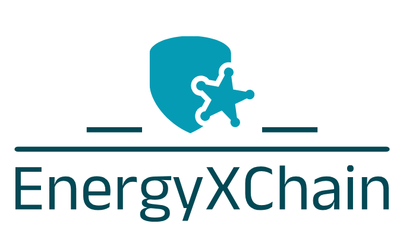

**Typography**

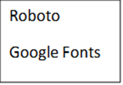

La tipografía es necesaria para estructurar y organizar el lenguaje
visual de todas las plataformas que se desarrollaran para cumplir con
las características principales de la aplicación. Se ha tomado en cuenta
que las fuentes deben ser legibles y deben aportar a la experiencia del
usuario, por ello se optó por estos tipos de letra.

**Head**

| Name      | Font size | Line Height |
|-----------|-----------|-------------|
| Heading 1 | 56 px     | 61.6 px     |
| Heading 2 | 48 px     | 52.8 px     |
| Heading 3 | 40 px     | 44 px       |
| Heading 4 | 32px      | 35.2 px     |
| Heading 5 | 24px      | 26.4 px     |
| Heading 6 | 20px      | 22 px       |

**Body**

| Name                 | Font size | Line Height |
|----------------------|-----------|-------------|
| **Large Text Bold**  | 20 px     | 28 px       |
| Large Text Regular   | 20 px     | 28 px       |
| **Medium Text Bold** | 18 px     | 25.2 px     |
| Medium Text Regular  | 18 px     | 25.2 px     |
| **Normal Text Bold** | 16 px     | 22.4 px     |
| Normal Text Regular  | 16 px     | 22.4 px     |
| **Small Text Bold**  | 14 px     | 19.6 px     |
| Small Text Regular   | 14 px     | 19.6 px     |

**Color
Palette**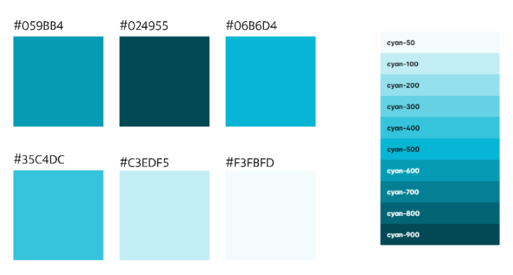

**Spacing**

**Tono de comunicación y lenguaje aplicado**

El tono de comunicación y lenguaje aplicado para EnergyXChain es
profesional, claro y accesible. Se utilizará un lenguaje técnico cuando
sea necesario para explicar aspectos relacionados con la tecnología
blockchain y la gestión de transacciones energéticas, pero se evitará en
la medida de lo posible el uso de jerga técnica compleja para garantizar
la comprensión por parte de todos los usuarios. El tono será amigable y
orientado al usuario, transmitiendo confianza y seguridad en la
plataforma, al mismo tiempo que se enfatiza la importancia de la
transparencia y la protección de la privacidad en todas las
interacciones.

6.1.2. Web, Mobile & Devices Style Guidelines.

Desarrollaremos una aplicación que se adeque a cualquier dispositivo
tecnológico sin la necesidad de arruinar el diseño del contenido. Por
ello, se tendrá que tomar en cuenta cada tipo de dispositivo para que el
contenido este estructurado de la mejor manera para cada uno.

Emplearemos el patrón Z, pues de esta manera identificaran nuestra marca
o logo que se encontrara en la esquina superior izquierda, donde
comenzara la interacción del usuario. Luego, se desplazará hacia la
derecha donde visualizará las diferentes opciones que ofreceremos como
como Lista de Proveedores, Proceso de compra y HIstorial de consumo.
Siguientemente, el usuario se desplazará verticalmente hacia abajo para
seguir interactuando con el contenido de la aplicación. Finalmente, el
usuario llegará a la esquina inferior derecha donde podrá visualizar
todas nuestras redes sociales y nuestros medios de contacto.

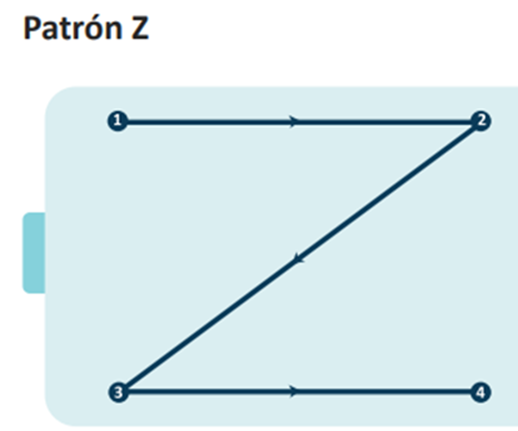

Siguientemente, el diseño de nuestra aplicación contara con colores que
motiven al usuario a seguir interactuando con la plataforma. Asimismo,
se contará con sombras y espacios que favorezcan la lectura de la
información y limiten el contenido para no abrumar al navegante.

Se emplearán algunos de los siguientes elementos:

6.2. Information Architecture.

En esta sección, definiremos la estructuración de nuestro producto para
cada uno de nuestros segmentos objetivo. Abarcaremos diversos
componentes que permitirán al usuario a organizar y encontrar su
contenido: Labeling systems, SEO Tags and Meta Tags, Searching systems y
Navigation systems.

6.2.2. Labeling Systems.

A continuación, se mostrará el sistema de etiquetado que permitirá a
nuestros visitantes recibir la información que nuestra Landing page
ofrece a través de una sola palabra.

Contamos con cuatro “headings” con fuente sans-serif ubicadas en la
parte superior del Landing page:

> Inicio: Sección seleccionada por defecto dónde los usuarios verán la
> información más relevante, la cual captará su atención.
>
> Nosotros: Sección dónde el cliente podrá ver nuestra misión, visión,
> quienes somos y qué hacemos.
>
> Servicios: Sección enfocada en listar y detallar los servicios que
> ofrecemos.
>
> Contacto: Sección dónde se detalla cuáles son nuestros canales de
> comunicación y nuestra ubicación.

En el caso del Web Aplication para clientes contamos con cinco
“headings” con fuente Lato ubicadas en el menú principal de la parte
lateral izquierda:

> Dashboard: Sección seleccionada por defecto dónde se encuentran los
> últimos registros de consumo de electricidad en el último mes.
>
> Lista de Proveedores: Sección dónde se encuentran los distintos
> proveedores para que el usuario pueda decidir entre ellos cual volver
> su proveedor de energía.
>
> Mis Pagos: Sección dónde saldrá una lista con los pagos recientes y
> los pagos pendientes.
>
> Historial de consumo: Sección dónde el cliente verá un registro
> detallado de sus más recientes consumos.

En el caso del Web Aplication para proveedores contamos con 2 “headings”
con fuente Lato ubicadas en el menú principal de la parte lateral
izquierda:

> Servicios: Sección donde el proveedor verá una lista de sus servicios
> y podrá visualizar información de estos mismos y podrá crear uno nuevo
> en caso desee.
>
> Clientes: Sección donde el proveedor verá una lista de sus clientes y
> podrá visualizar información de este mismo y su contrato con el
> proveedor.
>
> Ganancias: Sección dónde se encuentra un registro de los pagos
> realizados por los clientes.

6.2.3. Searching Systems.

A continuación, se mostrarán los sistemas de búsqueda implementados para
ayudar a nuestros usuarios a encontrar la información que están
buscando.

Para el Landing Page, no se ha implementado un sistema de búsqueda, ya
que la información esta segmentada y enlaza con el menú principal. Por
esto mismo, podrán buscar toda la información necesaria para poder
identificar lo más importante de nuestra solución, como a que nos
dedicamos o cuales son nuestros servicios o principalmente podrán buscar
los contactos para que puedan comunicarse con nosotros.

Para el caso del Web Application:

**Segmento 1: Clientes**

> · Lista de Proveedores: Esta sección le permitirá cliente visualizar
> la lista de proveedores de energía disponibles, donde podrá ver a
> detalle la información del proovedor, en caso el usuario esté conforme
> con uno en específico, tendrá la opción de contratarlo en la misma
> vista, donde deberá llenar un formulario con su método de pago, de
> este modo se realizará el pago de forma segura utilizando blockchain.
>
> · Mis Pagos: En esta sección el usuario podrá ver sus recibos pagados
> así como los pendientes, en caso desee podrá pagarlos desde ahí mismo
> a través de un formulario.

**Segmento 2: Proveedores**

> · Clientes: Los proveedores podrán ver información detallada de cada
> uno de los clientes que hayan realizado contratos con ellos, así como
> visualizar estos contratos y su historial de consumo de los clientes,
> para asegurarse que están pagando puntualmente.
>
> · Ganancias: Los proveedores contarán con una vista donde visualizarán
> los pagos realizados por cada cliente, así como los pagos pendientes
> que deberán recibir este mes.

6.2.4. SEO Tags and Meta Tags.

A continuación, se mostrarán los SEO Tags y Meta Tags utilizados en el
Landing Page con el propósito de aumentar su visibilidad en los motores
de búsqueda.

Landing Page:

\<head\>  
  
\<meta charset="UTF-8"\>  
\<meta name="viewport" content="width=device-width,
initial-scale=1"/\>  
  
  
  
\<meta name="description" content="Landing page aimed at energy
transactions"/\>  
  
  
  
\<meta name="keywords" content="EnergyXChain, Inicio, Nosotros,
Servicios, Contacto, Landing Page "/\>  
  
  
  
\<meta name="author" content="EnergyXChain team"/\>  
  
  
  
  
  
  
  
\<title\> EnergyXChain the best place for safe energy. \</title\>  
  
  
  
\</head\>

6.2.5. Navigation Systems.

A continuación, se mostrarán los sistemas de navegación que le
permitirán a nuestros usuarios moverse a través de las distintas piezas
de contenido o información.

El Landing Page contará con un menú de navegación simple y claro ubicado
en la parte superior de la página, que incluirá las siguientes
secciones:

> Inicio: Esta sección será la página de inicio predeterminada, donde
> los visitantes encontrarán la información más relevante sobre
> EnergyXChain.
>
> Nosotros: Aquí, los usuarios podrán conocer más sobre la misión,
> visión y valores de EnergyXChain, así como información sobre el equipo
> detrás del proyecto.
>
> Servicios: Esta sección proporcionará detalles sobre los servicios
> ofrecidos por EnergyXChain, brindando una visión completa de las
> soluciones disponibles.
>
> Contacto: La sección de contacto permitirá a los usuarios encontrar
> información de contacto y detalles de ubicación para comunicarse con
> el equipo de EnergyXChain.

Por otro lado, en el caso del Web Application, se tiene una barra de
navegación global-vertical-lateral dónde se encuentran las secciones
principales de la interfaz del usuario. Estas secciones se navegan de la
siguiente forma:

> **Segmento 1: Clientes**
>
> Dashboard: Esta será la página de inicio predeterminada para los
> clientes, mostrando un resumen de los últimos registros de consumo de
> energía.
>
> Lista de Proveedores: Los clientes podrán acceder a esta sección para
> explorar y seleccionar entre los diferentes proveedores de energía
> disponibles.
>
> Mis Pagos: Aquí, los usuarios podrán ver un registro de sus pagos
> pasados y pendientes, así como realizar nuevos pagos si es necesario.
>
> **Segmento 2: Proveedores**
>
> Clientes: En esta sección, los proveedores podrán acceder a la
> información detallada de sus clientes, incluidos los contratos y el
> historial de consumo.
>
> Ganancias: Los proveedores podrán visualizar un resumen de los pagos
> realizados por sus clientes, así como los pagos pendientes que deben
> recibir.

6.3. Landing Page UI Design.

Las Landing Pages se emplean para convertir a los visitantes en posibles
clientes mediante estrategias como mensajes atractivos y detalles sobre
el producto, entre otras tácticas. Por este motivo, optamos por utilizar
esta herramienta, desarrollando una versión preliminar tanto para
dispositivos móviles como para computadoras.

6.3.1. Landing Page Wireframe.

En esta sección, se establecerá la base para el diseño del sitio web de
nuestro software, con fundamentos que brinden una comprensión clara del
contenido que se presentará en la plataforma y su versión móvil.

El Landing Page estará dimensionado adecuadamente para adaptarse a las
pantallas de cada dispositivo, asegurando que la información se centre
en la pantalla para una fácil visibilidad por parte del usuario.

Nuestro objetivo es proporcionar información precisa sin abrumar al
usuario. Para lograrlo, implementaremos una barra de navegación estática
que facilite la exploración de la Landing Page.

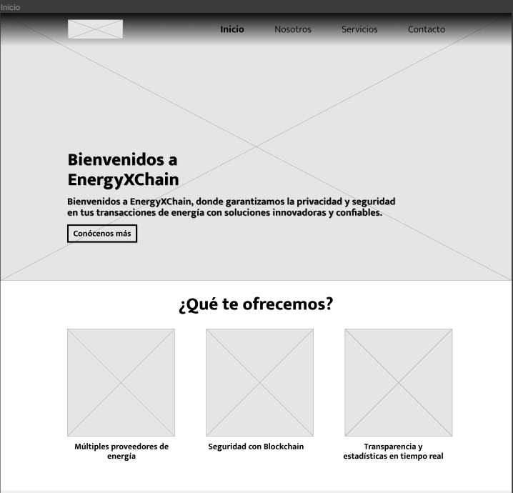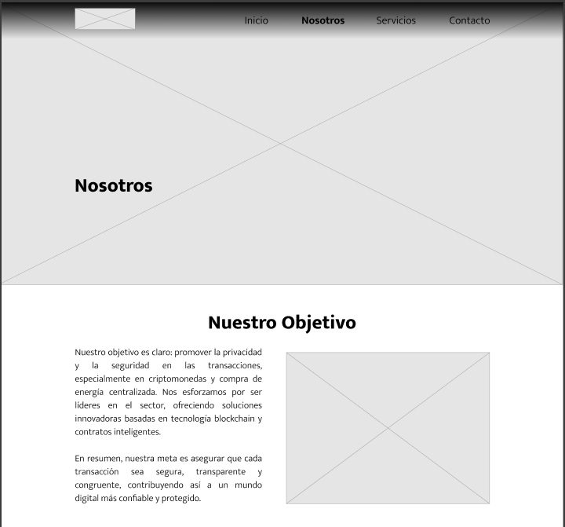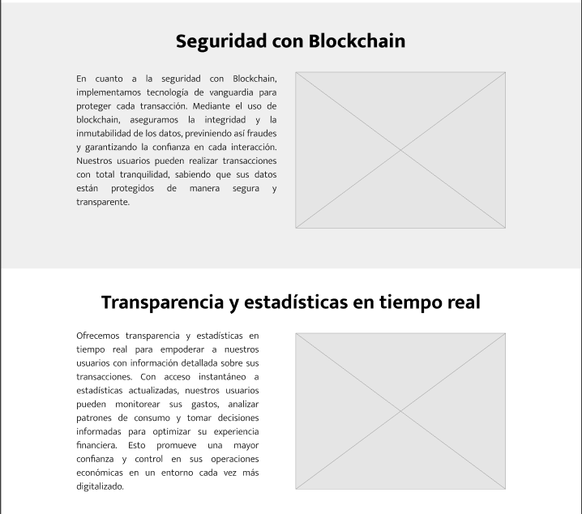

6.3.2. Landing Page Mock-up.

Se exhibe la versión preliminar de nuestro sitio web, describiendo su
contenido y aplicando los colores correspondientes según nuestra guía de
estilos. Además, se integrarán imágenes pertinentes para complementar la
información presentada, con el fin de ofrecer al usuario una comprensión
más clara de los conceptos que estamos comunicando.

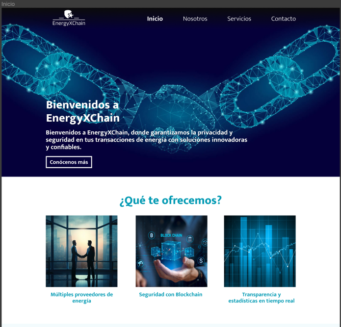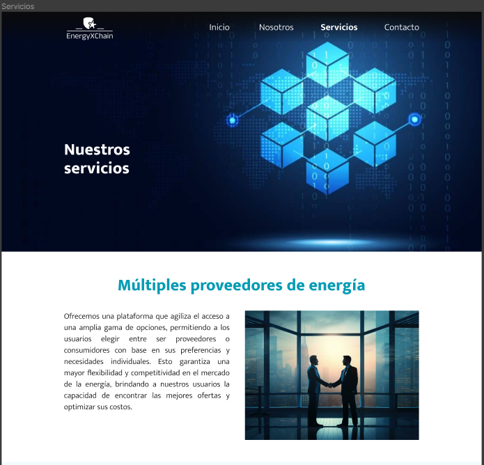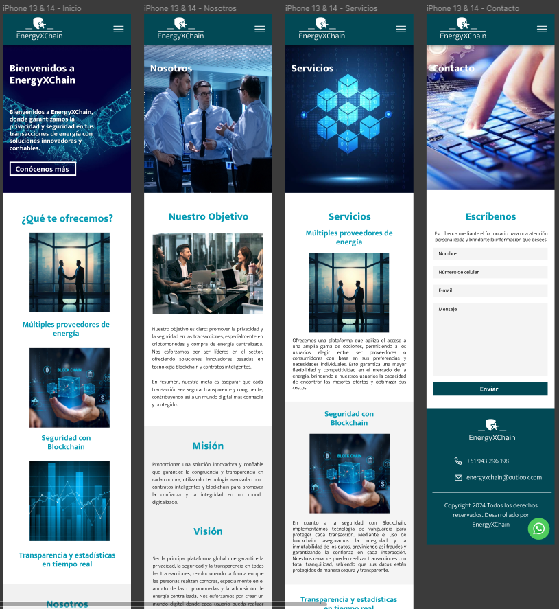

6.4. Applications UX/UI Design.

Nos centra en la experiencia del usuario y el diseño de interfaz de
nuestras aplicaciones. Aquí, exploramos cómo interactúan los usuarios
con nuestro software y cómo podemos diseñar interfaces intuitivas y
atractivas que mejoren su experiencia. Desde la conceptualización hasta
la implementación, cada aspecto del diseño se examina cuidadosamente
para garantizar que nuestras aplicaciones sean fáciles de usar y
satisfagan las necesidades y expectativas de nuestros usuarios.

6.4.1. Applications Wireframes.

- Cliente

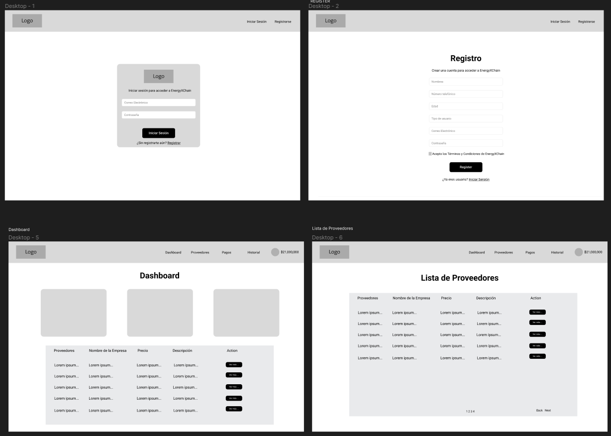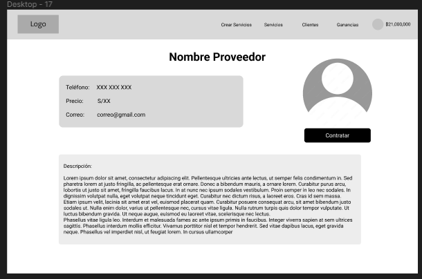

- Proveedor

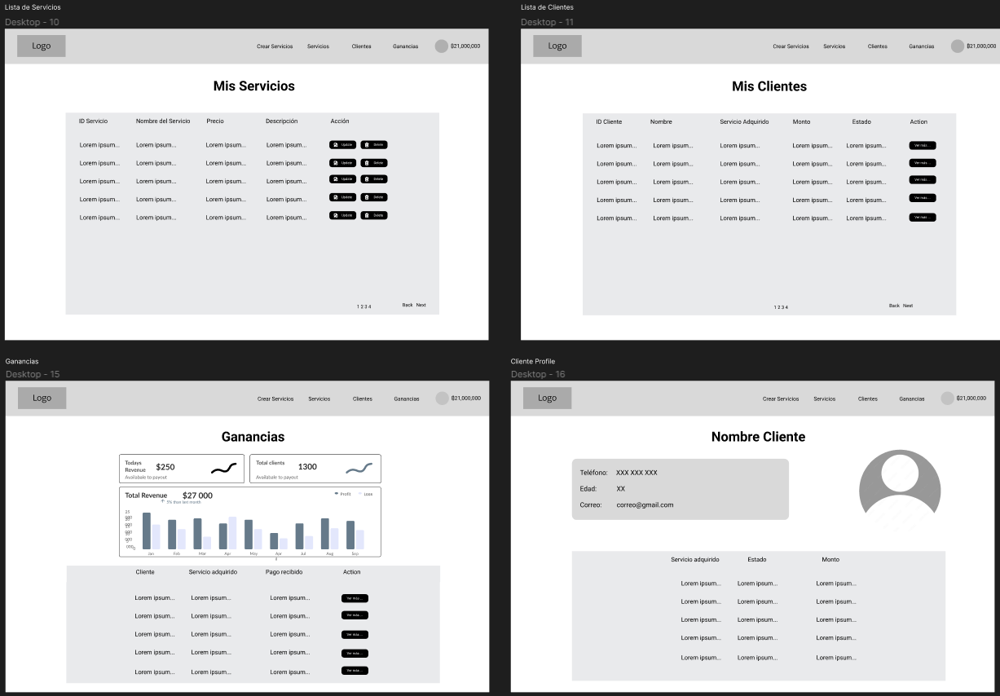

Enlace:
<https://www.figma.com/file/zeg6gB0Z0zeeXmZHPnVIzv/EnergyXChain-Web-Application?type=design&node-id=0%3A1&mode=design&t=gZfZlBXys69N2wmk-1>

6.4.2. Applications Wireflow Diagrams.

**Segmento Objetivo Clientes**

**User Goal: Como cliente, deseo ingresar sesión para entrar a
EnergyXChain**

**Descripción:**  
En el presente Wireflow, se evidencia el flujo que seguirá el usuario
cliente para poder iniciar sesión. Iniciará en el login, ingresará su
DNI y contraseña, para poder ingresar a EnergyXChain.

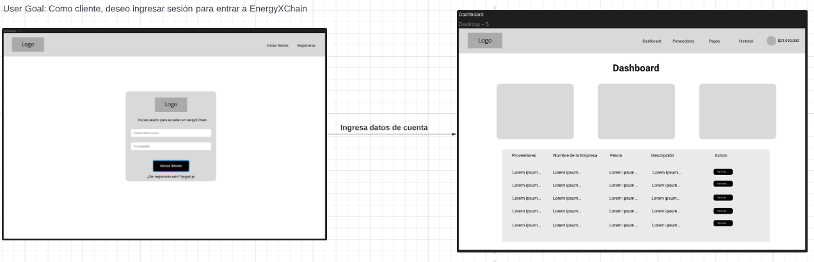

**User Goal: Como cliente, deseo registrarme para tener una cuenta en
EnergyXChain**

**Descripción:**  
En el presente Wireflow, se evidencia el flujo que seguirá el usuario
cliente para registrarse en la plataforma, donde deberá seleccionar la
opción de “Registar”, completar el formulario y confirmar el proceso.

**User Goal: Como cliente, deseo cambiar mi contraseña**

**Descripción:**

Al momento de iniciar sesión, se presentará una opción de olvide mi
contraseña, cuando le de click, redireccionará al usuario a una nueva
pantalla donde ingresará su email y su nueva contraseña.

**User Goal: Como cliente, deseo ver la lista de proveedores**

**Descripción:**  
Una vez el usuario esté logueado, en el Dashboard en la parte superior
deberá darle click a la opción “Proveedores” donde lo llevará a una
tabla con la lista de todos los proveedores y sus servicios disponibles.

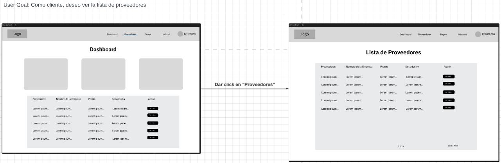

**User Goal: Como cliente, deseo contratar un proveedor**

**Descripción:**

Para contratar un servicio de un proveedor, primero el usuario deberá
darle a la opción de “Proveedores”, buscar en la lista de proveedores el
de su mayor interés, para ver más información da click en uno, y en caso
le convezca le da al botón de “Contratar”, esto lo llevará a un
formulario de pago donde colocará su método de pago, finalmente, podrá
ver un mensaje de confirmación.

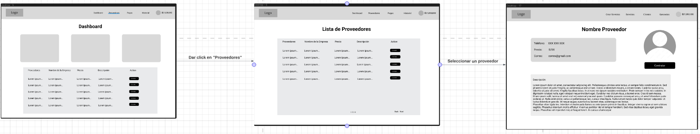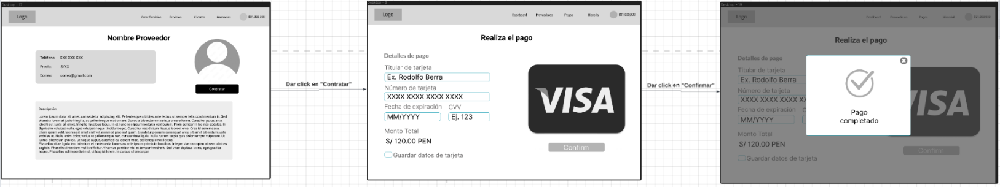

**User Goal: Como cliente, deseo ver mis pagos realizados**

**Descripción:**

Para visualizar los pagos realizados por el cliente de sus servicios,
deberá seleccionar la opción “Pagos” en el nav-bar.

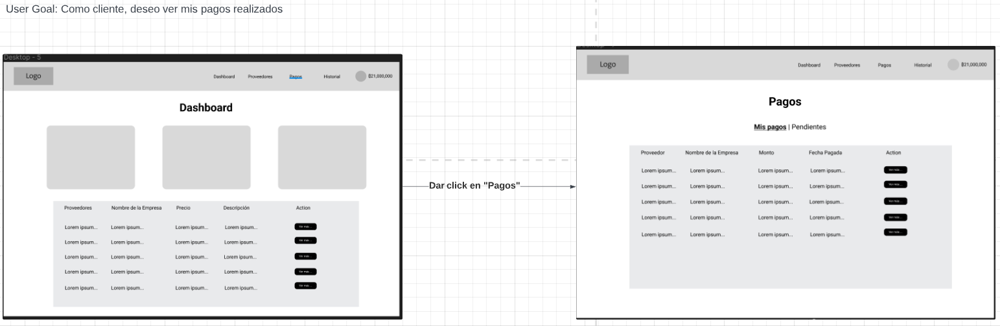

**User Goal: Como cliente, deseo ver mis pagos pendientes**

**Descripción:**

Para visualizar los pagos pendientes por el cliente primero deberá
seleccionar la opción “Pagos” en el nav-bar y luego la sección
“Pendientes” para que la tabla muestre los pagos pendientes a pagar por
el cliente.

**User Goal: Como cliente, deseo ver mi historial**

**Descripción:**

Para que el usuario vea el historial de todos sus pagos realizados junto
con información de este mismo, deberá darle click a la opción
“Historial” en el nav-bar.

**Segmento Objetivo Proveedores**

**User Goal: Como proveedor, deseo ingresar sesión para entrar a
EnergyXChain**

**Descripción:**  
En el presente Wireflow, se evidencia el flujo que seguirá el usuario
proveedor para poder iniciar sesión. Iniciará en el login, ingresará su
DNI y contraseña, para poder ingresar a EnergyXChain.

**User Goal: Como proveedor, deseo registrarme para tener una cuenta en
EnergyXChain**

**Descripción:**  
En el presente Wireflow, se evidencia el flujo que seguirá el usuario
proveedor para registrarse en la plataforma, donde deberá seleccionar la
opción de “Registar”, completar el formulario y confirmar el proceso.

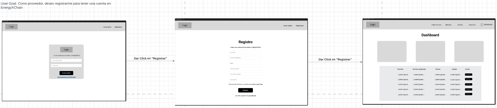

**User Goal: Como proveedor, deseo cambiar mi contraseña**

**Descripción:**

Al momento de iniciar sesión, se presentará una opción de olvide mi
contraseña, cuando le de click, redireccionará al usuario a una nueva
pantalla donde ingresará su email y su nueva contraseña.

**User Goal: Como proveedor, deseo crear un nuevo servicio**

**Descripción:**  
Una vez el usuario esté logueado, en el Dashboard en la parte superior
deberá darle click a la opción “Servicios”, de esa forma podrá ver una
lista con todos sus servicios creados y su información, para crear uno
nuevo se deberá dar click al botón en la parte inferior de la pantalla
“Crear”, finalmente, deberá llenar el formulario y dar click al botón
“Publicar”

**User Goal: Como proveedor, deseo ver mis clientes**

**Descripción:**

Si el proveedor desea ver la lista con sus clientes, deberá dar click en
la opción “Clientes” en el nav-bar, de esta forma podrá ver la lista con
todos sus clientes asociados a sus servicios.

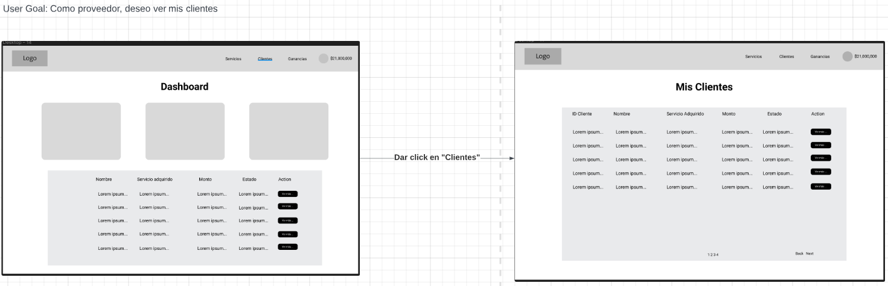

**User Goal: Como proveedor, deseo ver información de un cliente en
específico**

**Descripción:**  
Si el proveedor desea ver la información de un cliente en específico,
deberá dar click en la opción “Clientes” en el nav-bar, de esta forma
podrá ver la lista con todos sus clientes asociados a sus servicios,
donde podrá buscar el cliente que busca, luego le dará click al botón de
“Ver más”, donde lo llevará a una vista con la información del cliente
seleccionado.

**User Goal: Como proveedor, deseo ver mis Ganancias**

**Descripción:**

Si el proveedor desea ver la información de sus ganancias hasta el día
de hoy, deberá dar click a la opción “Ganancias” en el nav-bar, de esta
forma podrá ver unos gráficos donde se resuma los últimos ingresos en
los últimos días, así como una tabla con los últimos pagos realizados
por sus clientes.

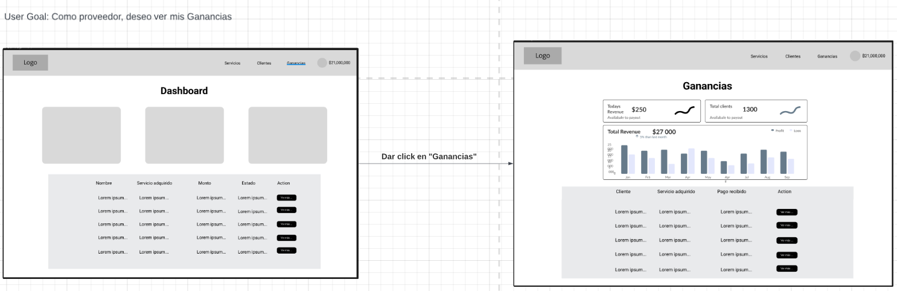

Enlace de Wireflows:
<https://lucid.app/lucidchart/193b0476-9ecf-4972-919e-695299bf6c34/edit?viewport_loc=-2061%2C15784%2C3676%2C1602%2C0_0&invitationId=inv_1aa36791-c25e-4dd7-9a17-a8353008e473>

**Conclusiones**

- Enfoque en la innovación: EnergyXChain representa una propuesta
  innovadora en el campo de las transacciones energéticas, al combinar
  la tecnología blockchain con la gestión de consumo de energía.

- Seguridad y transparencia: La implementación de la tecnología
  blockchain garantiza la seguridad y la transparencia en todas las
  transacciones, lo que genera confianza tanto para los clientes como
  para los proveedores de energía.

- Experiencia del usuario: Se ha prestado una atención especial a la
  experiencia del usuario, desde el diseño de la interfaz hasta la
  facilidad de navegación en las diferentes plataformas (Landing Page y
  Web Application), lo que mejora la satisfacción del usuario y facilita
  el uso de la plataforma.

- Diversidad de funciones: EnergyXChain ofrece una amplia gama de
  funciones tanto para clientes como para proveedores, desde la
  visualización de proveedores de energía hasta el monitoreo del consumo
  de energía en tiempo real, lo que cubre las necesidades de ambos
  segmentos de usuarios.

- Foco en la integridad de la transacción: El registro detallado del
  historial de consumo y los pagos realizados proporciona una mayor
  transparencia y confiabilidad en todas las transacciones, lo que
  fortalece la integridad del sistema.

- Interoperabilidad y accesibilidad: EnergyXChain se adapta a las
  necesidades y preferencias de los usuarios al ofrecer una plataforma
  compatible con dispositivos móviles y de escritorio, lo que garantiza
  su accesibilidad en diferentes entornos y situaciones.

- Colaboración entre sectores: Al permitir que los proveedores de
  energía y los consumidores interactúen directamente en la plataforma,
  EnergyXChain fomenta la colaboración y la relación directa entre ambos
  sectores, lo que puede conducir a una mayor eficiencia en el mercado
  energético.

- Potencial de crecimiento y escalabilidad: Con una base sólida de
  tecnología blockchain y una arquitectura diseñada para la expansión,
  EnergyXChain tiene un gran potencial para crecer y adaptarse a las
  necesidades cambiantes del mercado energético en el futuro.

- Impacto ambiental positivo: Al facilitar el acceso a la energía
  descentralizada y promover la eficiencia energética a través de la
  transparencia y la gestión inteligente del consumo, EnergyXChain
  contribuye a la reducción del impacto ambiental y fomenta prácticas
  más sostenibles en el uso de la energía.
